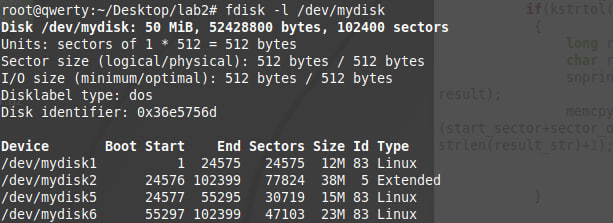
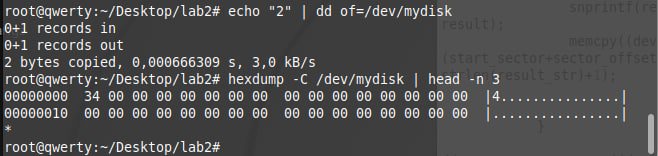
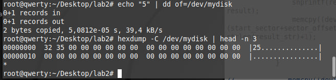
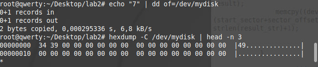

# Лабораторная работа 2

**Название:** "Разработка драйверов блочных устройств"

**Цель работы:** получить знания и навыки разработки драйверов блочных 
устройств для операционной системы Linux.

**Вариант:** 6

## Описание функциональности драйвера

Один первчиный раздел размером 12 МБайт и один расширенный раздел, содержащий два логических раздела размером 15 МБайт и 23 МБайт. 

Каждый записываемый байт должен возводиться в квадрат.
## Инструкция по сборке

Сборка модуля:

```
make
```

Сборка с последующей установкой:

```
make install
```

Отключение модуля:

```
make uninstall
```

Очистка артефактов сборки:

```
make clean
```

## Инструкция пользователя

Для начала проверим, что диск дейтвительно существет, выполнив команду:

```
fdisk -l /dev/mydisk
```

Получаем результат:



## Проверка на соответствие второй части задания

```
echo "2" | dd of=/dev/mydisk
```



```
echo "5" | dd of=/dev/mydisk
```



```
echo "7" | dd of=/dev/mydisk
```




## Измерение скорости передачи данных между дисками

скрины так далее


### Скорости передачи данных (MiB/s)

| Размер файла | N тестов | Виртуальный -> Виртуальный | Виртуальный -> Реальный | Реальный -> Виртуальный |
| ------------ | -------- | -------------------------- | ----------------------- | ----------------------- |
| 1 MiB        | 3        | 1084                       | 595                     | 1090                    |
| 4 MiB        | 3        | 1044                       | 927                     | 1249                    |
| 7 MiB        | 3        | 751                        | 742                     | 787                     |
