# Вопросы для подготовки к экзамену

(2023)

- Если ответ на вопрос уже звучал (учащийся мог его слышать) -- вариант на этот вопрос генерируется повторно (для индивидуального варианта и доп. вопросов).

## Для всех групп

### Вопрос_1. Что такое компьютерная система? Отличие информационной и управляющей системы? Почему большинство современных компьютерных систем считаются системами с преобладающей программной составляющей? Примеры. Понятие информационного процессора.

Компьютерная система - Любая система, оснащённая внутренними алгоритмами управления. (светодиодная лампа, кабели для зарядки мобильных телефонов, компьютер и т.п.) Такое шиорокое определение обусловлено современными реалиями, когда практически любой микроконтроллер будет по мощности превосходить мэйнфреймы времён появления определения ЭВМ.

Большинство систем являются системами с преоблдающей программной составляющей так как для большинства систем (кроме тех у которых полностью кастомный hardware), основная стоимость раззработки и основная реализация управляющих алгоритмов находится на стороне ПО. Это позволяет нам применять по отношению к современным компьютерным системам методологию из чисто программных систем(стандарты из области системной и программной инженерии например). 

Информационные системы - Система, которая получает информацию, видоизменяет/сохраняет её и передаёт её дальше (Word, браузер и т.п.). Основной приоритет для таких систем - производительность. Особенности - Спекулятивные вычисления, Параллелизм, Кластерные и облачные вычисления. 

Управляющие системы - системы, взаимодействующие с реальным физическим миром с целью контроля или управления. Особенности - встроенное исполнение (ограниченные ресурсы, специализированная аппаратура), работа в режиме реального времени(предсказуемая работа в заданное время), автономная эксплуатация. Пример - Видеокодек в медипроигрывателе (скорость работы должна быть ровно такой, чтобы правильно обработать файл. Если это делать медленнее или быстрее, то видео будет проиграно некорректно).

Конечно существуют системы, совмещающие информационные и упраляющие. 

То есть для информационных систем фокус - скорость их работы, для управляющих - их предсказуемость. 

Информационный процессор - Процессор, который в ответ на команду выполняет действие над концептуальной схемой и/или информационной базой. (http://csa.edu.swampbuds.me/08-09-10-processors-von-neumann-cisc-risc-stack.md#/1/1)

### Вопрос_2. Системная инженерия. Понятие системы. Варианты рассмотрения систем. Модульность. Жизненный цикл. Операционное окружение и обеспечивающие системы. Заинтересованные стороны (stakeholders). Проблема передачи информации при разработке компьютерных систем.

Системная инженерия (SE) — это междисциплинарный подход и средство, позволяющее реализовать успешные системы. Он фокусируется на целостном и одновременном понимании потребностей заинтересованных сторон (стейкхолдеров); изучении возможностей; документировании требований; и синтезе, проверке, приемке и разработке решений при рассмотрении всей проблемы, от исследования концепции системы до вывода системы из эксплуатации.

Система - совокупность взаимодействующих элементов, организованных для достижения одной или нескольких заданных целей. 

Идентичность системы определяется её функциональным местом.

Определение можно сузить, взглянув на конкретную рассматриваемую систему (на её задачи, предоставляемые функции). 
Или можно добавить уточняющее слово. Например aircraft system, computer system. 

Операционное окружение системы - окружение в которое встраивается система, то, какие в его рамках к системе выдвигаются требования и то, с чем система в его рамках будет взаимодействовать в ходе своей работы. Операционное окружение - важный фактор в определении требований к системе. 

Жизненный цикл системы:
	1. Концептуальный этап
	2. Этап разработки
	3. Этап производства
	4. Этап эксплуатации (утилизации(utilization))
	5. Этап поддержки
	6. Этап вывода из эксплуатации

Обеспечивающие системы — система, которая дополняет интересующую систему на этапах ее жизненного цикла, но не обязательно вносит непосредственный вклад в ее функционирование во время эксплуатации.
ПРИМЕЧАНИЕ 1 Например, когда система, представляющая интерес, вступает в стадию производства, требуется вспомогательная производственная система.
ПРИМЕЧАНИЕ 2 Каждая обеспечивающая система имеет свой собственный жизненный цикл. Этот Международный стандарт применим к каждой обеспечивающей системе, когда она сама по себе рассматривается как система, представляющая интерес.

Разработка успешной системы требует: 
	рассмотрения её структуры
	рассмотрения её операционного окружения
	рассмотрения особенностей её жизненного цикла
	рассмотрения её обеспечивающих систем

Заинтересованные стороны(stakeholders) - люди имеющие интерес к или влияние на систему. Такие как пользователи, клиенты, спонсоры, регуляторы или поставщики. Разработчики тоже входят в это понятие.

Проблема передачи информации при разработке компьютерных систем - ввиду:
	различий компетенций людей, работающих над системой
	неэффективно расставленых приоритетов разработки
	замены одной задачи на другую
	изменений требований к системе
	чрезмерно шаблонно выстроенного процесса разработки
некоторая информация при передаче между разработчиками, а также людьми, заинтересованными в системе, может быть утеряна. 

### Вопрос_3. Цели и задачи архитектурного проектирования компьютерных систем, его эффект. Понятие архитектуры. Различные трактовки (Гради Буч, ISO 42010 и д.р.) и их практическая значимость.

Цели и задачи архитектурного проектирования компьютерных систем, его эффект: 
	
	Целью архитектурного проектирования компьютерных систем является создание высококачественной, эффективной и надежной системы, которая удовлетворяет требованиям заказчика и пользователей. Архитектурное проектирование включает в себя определение общей структуры системы, ее компонентов и интерфейсов между ними.

	Задачи архитектурного проектирования включают:
	1. Определение требований к системе: архитектор должен понимать, какие функциональные и нефункциональные требования предъявляются к системе, чтобы разработать соответствующую архитектуру.
	2. Разработка концептуальной модели: архитектор должен создать модель системы, которая будет описывать ее общую структуру и компоненты.
	3. Определение архитектурных решений: архитектор должен выбрать технологии, платформы и инструменты, которые будут использоваться для реализации системы.
	4. Проектирование интерфейсов: архитектор должен определить, как компоненты системы будут взаимодействовать друг с другом, чтобы обеспечить эффективную и надежную работу системы.
	5. Оценка рисков: архитектор должен оценить риски, связанные с разработкой и эксплуатацией системы, и определить меры для их снижения.
	6. Создание документации: архитектор должен создать документацию, которая будет описывать архитектуру системы и ее компоненты.

	Эффект от архитектурного проектирования компьютерных систем заключается в создании высококачественной, эффективной и надежной системы, которая удовлетворяет требованиям пользователей и заказчика. Хорошо спроектированная система обеспечивает легкость сопровождения и расширения, что позволяет снизить затраты на ее эксплуатацию. Кроме того, хорошо спроектированная система обеспечивает высокую производительность и масштабируемость, что позволяет обеспечить эффективную работу системы в условиях высоких нагрузок.

Архитектура:
	
	По Гради Бучу:
		Архитектура
			логическая и физическая структура компонентов системы и их взаимосвязи, сформированные всеми стратегическими и тактическими проектными решениями, применяемыми во время разработки. 
		Логический взгляд
			на систему учитывает концепции, созданные в концептуальной модели, и устанавливает существование и роль ключевых абстракций и механизмов, которые будут определять архитектуру и общий дизайн системы. 
		Физическая модель
			системы описывает конкретный программный и аппаратный состав реализации системы. Очевидно, что физическая модель зависит от конкретной технологии. 
^ Тут у нас 2 части - концептуальная часть и физическая
	
	По ISO 42010:
		Архитектура
			- фундаментальные концепты или свойства системы в её окружении, олицетворяемые её элементами, отношениями и принципами её дизайна и эволюции. 
		Описание архитектуры
			- производственный продукт, используемый для описания архитектуры
			Нет единого понятия того, что необходимо или фундаментально для любой системы. Эта характеристика может относиться/включать:
				составляющие системы
				как и в каких отношениях её элементы расположены относительно друг друга
				принципы организации и дизайна системы
				принципы эксплуатации и эволюции системы в процеесе её жизненного цикла
^ Тут у нас всё вместе. Физ. и Лог. представления рассматриваются вместе
	
	Интернет:
		архитектура - набор решений, которые если сделаны неправильно могут привести к провалу/отмене проекта

	Eoin Woods (SEI 2010):
		Архитектура программного обеспечения (ru) — это набор проектных решений, которые, если они будут приняты неправильно, могут привести к отмене вашего проекта.

	Таким образом, можно приближённо сказать, что архитектура - это всё то, что для рассматриваемой системы является важным, оказывающим на неё непосредственное влияние. 

### Вопрос_4. Реле как базис компьютерной системы. Область применения и принципы построения систем на базе реле. Примеры релейных схем и принцип их функционирования. Формирование логического базиса.

Реле - элемент автоматических устройств, который в зависимости от некоторого внешнего влияния, либо пропускает ток, либо нет. 

В контексте компьютера речь идёт об электрических реле. Электрическое реле состоит из: магнитной катушки, ключа, входа и выхода. В завимости от состояния ключа, реле, получая ток на вход, будет либо пропускать этот ток на выоход, либо нет. 
На основе комбинаций из реле можно реализовать простейшие логические операции (AND OR NOT(полный набор булевых функций)). А на этих операций уже все остальные.

В совреенных компьютерах реле были заменены на транзисторы. Тем не менее, реле до сих пор используются в быовой технике (автоматическое включение и выключение), электродвигателях. 

Пример: при последовательном соединении реле мы получим AND, при параллельном - OR. 

### Вопрос_5. Принципы кодирования информации в компьютерных системах. Двоичный код, достоинства и недостатки. Машинное слово и адресация. Код грея, BCD, Base64.

Логические 1 и 0 кодируются на самом низком уровне как электрический сигнал. Существует диапазон напряжения для 1 и для 0. Таким образом, скажем, что для 1 - y и для 0 - x. Все сигналы >=y интерпретируются как 1, все сигналы <=x интерпретируются как 0. При этом существует диапазон (x, y) в котором значение напряжения интерпретируется случайно (forbidden zone). 

Двоичное кодирование:
	
	Достоинства:
		1. Надёжно и помехоустойчиво (в отличие от аналоговой схемотехники, ошибки не накапливаются)
		2. Арифметику просто реализовать
		3. Диапазоны и точность наращиваются с разрядностью
		4. Погрешности "by design" а не "by implementation" (В отличие от аналоговой схемотехники, достаточное качество производства строго определено. Появляется одинаковость результатов работы между устройствами, произведёнными в разных местах)

	Недостатки:
		1. Трудночитаемое представление 
		2. Простые десятичные дроби записываются в виде бесконечных дробей
		3. Дискретное кодирование (точность)

Код Грея:
	
	изменённый двоичный код, в котором две соседние кодовые комбинации отличаются только 1 цифрой в 1 соседнем двоичном разряде. Был разработан для реализации в системах, подверженных помехам при передаче сигнала. 

BCD:
	
	Форма записи рациональных чисел, когда каждый десятичный разряд числа записывается в виде его четырёхбитного двоичного кода. Единственный плюс - человекочитаемость. Раньше большинство процессоров имело встроенный инструментарий для работы с BCD. Позднее, от использования BCD стали отказываться, так как люди, работающие с компьютерами в своей массе осознали концепцию двоичного кодирования и работы с числами в разных системах счисления. Так например при переходе с x86 на x86_64 intel убрали из набора инструкций BCD-инструкции, чтобы закодировать на их месте что-то более полезное. 

Base64:
	
	 Стандарт кодирования двоичных данных при помощи только 64 ASCII символов. (A-Z, a-z, 0-9, 2 доп символа). Кодирование имеет ширину 6 бит. 

Машинное слово - единица данных, естественная для обработки вычислительной системой.

Существует 2 варианта порядка байтов - Big endian и little endian. Big endian - слева направо от старшего к младшему, аналогично тому, как человек записывает десятичные числа. little endian - старший справа, младший слева(от младшего к старшему). 
Преимущество little endian в том, что в случае расширения единицы хранения, появившиеся нули будут незначащими. 
Некоторые современные архитектуры поддерживают оба порядка и позволяют совершать переключение между ними. 

### Вопрос_6. Что такое комбинационная схема? Состояние и параллелизм в комбинационных схемах и схемах с регистрами, переходные процессы. Чтение и запись значений в регистры. Состояние `x` и `z`. Параллелизм уровня битов. Особенности поведения комбинационных схем по сравнению с программами.

Комбинационная схема - схема, составленная из набора логических элементом, в совокупности реализующая заданную таблицу истинности. 
Реализация каких-то функций с помощью булевой алгебры. 
Таким образом, это создание какой-то таблицы истинности, напрямую коррелирующей с отображением ограниченного множества A на ограниченное множество B.

Свойства комбинационных схем:
	
	1. приход схемы в стабильное состояние при корректном входе.
	2. задержка установления стабильного состояния после изменения входных значений
	3. параллелизм уровня бит (узлы схемы работают параллельно)
	4. Накопление ошибки в физическом процессе может привести к ошибке на логическом уровне (использование буферов, то есть элементов, которые будут восстанавливать электрический сигнал до нужного уровня между операциями)

В схемотехнике кроме 0 и 1 есть состояния z и x.
	
	z - отключено, настоящий электрический 0.
	x - неизвестно, произвольное значение, выдаваемое функцией, при выходе за её диапазон значений. 

Результаты работ функций реализованных комбинационными схемами нужно куда-то сохранять. Для этого существуют триггеры. 
Триггер — класс электронных устройств, обладающих способностью длительно находиться в одном из двух устойчивых состояний и чередовать их под воздействием внешних сигналов.
	
	D триггер
		- запоминает состояние входа и выдаёт его на выход

	RS триггер
		- асинхронный триггер, сохраняющий своё предыдущее состояние при неактивном состоияни обоих входов. Изменяет состояние при подаче на один из его входов активного уровня сигнала. 

Из множества триггеров в современных компьютерах формируются регистры. 

хранение Состояний позволяет:
	
	хранить состояния (ценно само по себе)
	Производить вычисления в несколько шагов, то есть строить многотактовые схемф
	Реализовывать конвейрное исполнение (количество стадий определяет количество параллельно выполняемых задач)
	Производить итеративные расчёты
	Реализовывать программное управление

### Вопрос_7. Аппаратное обеспечение. Виды монтажа и особенности производства. Навесной и поверхностный монтаж. Интегральные схемы. Проблемы, специфичные для аппаратного обеспечения: производство, эксплуатация, устаревание.

Способы монтажа(сборки) электронных схем:
	
	Навесной монтаж
		- способ монтажа при котором расположенные на изолирующем шасси радиоэлементы соединяются друг с другом проводами. Хрупок, недолговечен, пока не залит эпоксидной смолой, после чего уже не разбираем.

	Монтаж на макетной плате
		- подсоединение компонентов и их расположение на специальной макетной плате. Простой и доступный способ ввиду низкой цены, лёгкости сборки и гибкости. Тем не менее, неприменим для серийного, массового наукоёмкого производства ввиду сложности автоматизации сборки, высокой цены в серийном масштабе, проблем с помехами и точность, пока не залита эпоксидной смолой, что опять делает конструкцию неразборной. 

Печнатная плата - пластина из диэлектрика, на поверхности и/или в объёме которой сформированы электропроводящие цепи электронной схемы. Электрическое и механическое соединение компонентов.
	
	Монтаж на печатную плату
		- помещение всех соединений и компонентов на жёсткую печатную плату. Высокая плотность элементов, минимизация внешних помех. Общепринятый способ монтажа в современных компьютерах. Тем не менее, нереализуем любителем, требует промышленного фабричного производства. 

	Для помещения элемента на печатную плату используется поверхностный монтаж - на поверхности платы есть контактная площадка (слой меди), на него капают припоем, ставится элемент и припаевается. В результате получается жёсткая сцепка между компонентами. 

Таким образом, монтаж на печатную плату с помощью поверхностного монтажа хорошо подходит для автоматизации, то есть для промышленного производства электроники. 

	Также существует встроенный монтаж - монтаж элементов внутри платы, что позволяет делать могослойные платы. 

Интегральная схема (микросхема) - электронная схема произвольной сложности, изготовленная на полупроводниковой подложке (печатной плате) и помещённая в неразборный корпус. Часто интегральной схемой нахывается сама схема, до помещения её в корпус. 

Проблемы:
	
	Производство:
		Современные интегральные схемы невероятно трудоёмки и дороги в изготовлении ввиду своих масштабов.
		Ввиду вышеописанной сложности, часто результирующая интегральная схема получается хуже по своим параметрам, чем другие, произведённые прямо перед/за ней. Многие компании-производители процессоров продают такие процессоры как представителей "младшей" линейки с более слабыми характеристиками. 

	Эксплуатация:
		Электронные компоненты со времененм теряют свои свойства. 
		Для решения проблем с аппаратурой необходим непосредственный физический доступ. 
		Внешняя среда может оказывать вредное влияние на аппаратуру
		Различные долгосрочные эффекты. Например, оловянный припой со временем отращивает из себя нити, которые, коснувшись других элементов, могут привести к короткому замыканию.

	Поддержка:
		Отладка современных плат является сложным физическим процессом, требующим особых навыков и специальной аппаратуры.
		Сложность изменений: даже физический доступ к аппаратуре является ограниченным и очень многие ошибки этапов проектирования и производства не могут быть никак исправлены.
		Обслуживание стареющей аппаратуры. Старая аппаратура закономерно выходит из строя, элементной базы для замены больше не производят, так как старые линии производства постоянно заменяются на новые. 

### Вопрос_8. 2-этапное производство, варианты обеспечения. Понятия Hardware и Software, их свойства. Сравнение с понятиями программного и аппаратного обеспечения. Особенности. Причины разделения. Принципы совместного проектирование (HW/SW CoDesign).

Наличие в компьютерных системах аппаратной составляющей вводит большое количество проблем производства, эксплуатации и поддержки. Для решения, или скорее, смягчения этих проблем существует 2-этапное производство.  (проблемы см в 7 вопросе)

2-ух Этапное производство:
	
	- Производство относительно универсальной компьютерной системы (Hardware)
	- Настройка прикладного поведения (Software)

Обеспечение 2-этапного производства: в аппаратуру должны быть заложены при проектировании различные возможности конфигурации:
	
	1. На уровне сборки (Джамперы, платы расширения) 
		https://ru.wikipedia.org/wiki/%D0%94%D0%B6%D0%B0%D0%BC%D0%BF%D0%B5%D1%80
		https://ru.wikipedia.org/wiki/%D0%9A%D0%B0%D1%80%D1%82%D0%B0_%D1%80%D0%B0%D1%81%D1%88%D0%B8%D1%80%D0%B5%D0%BD%D0%B8%D1%8F

	2. Реконфигурации (Коммутации) ПЛИС, FPGA, CGRA
		https://ru.wikipedia.org/wiki/%D0%9F%D0%9B%D0%98%D0%A1
		https://ru.wikipedia.org/wiki/%D0%9F%D1%80%D0%BE%D0%B3%D1%80%D0%B0%D0%BC%D0%BC%D0%B8%D1%80%D1%83%D0%B5%D0%BC%D0%B0%D1%8F_%D0%BF%D0%BE%D0%BB%D1%8C%D0%B7%D0%BE%D0%B2%D0%B0%D1%82%D0%B5%D0%BB%D0%B5%D0%BC_%D0%B2%D0%B5%D0%BD%D1%82%D0%B8%D0%BB%D1%8C%D0%BD%D0%B0%D1%8F_%D0%BC%D0%B0%D1%82%D1%80%D0%B8%D1%86%D0%B0

	3. Программирования, настройки

Hardware, Software, сравнение с аппаратурой и ПО:

Аппаратное обеспечение - электронные и механические части вычислительного устройства, входящие в состав системы или сети, исключая программное обеспечение и данные (информацию, которую вычислительная система хранит и обрабатывает). Аппаратное обеспечение включает: компьютеры и логические устройства, внешние устройства и диагностическую аппаратуру, энергетическое оборудование, батареи и аккумуляторы. 

ПО - совокупность программ, системы обработки информации и программных документов, необходимых для эксплуатации. Позволяет аппаратному обеспечению вычислительной системы выполнять вычисления или функции управления. 

Software - То, то легко изменить/сконфигурировать в компьютерной системе, Hardware - То, что тяжело. В отрыве от привязки к аппаратной и не аппаратной части компьютерной системы. 

Таким образом, переходя на определения SW/HW с аппаратуры/ПО, мы отвязываем определения от физических концептов, которые не могут с должной точностью описать обсждаемую нами тематику. (ПЛИС - это ПО или аппаратура? HW или SW?)

Таким образом, SW/HW больше опирается на способ использования обсуждаемого предмета. 

Для удобства можем подвязать новые понятия со старыми - HW совпадает с аппаратной составляющей, если нет альтернативы (питание, антенны, аналоговые сигналы (их не виртуализируешь))

Типовая точка зрения на разрабатываемую систему:
Пишем програму----Проектируем аппаратуру

Обычно аппаратуру и ПО разрабатывают отдельно. Проблемы: излишне шаблонное проектирование, затягивание сроков.

SW/HW Codesign - разработка компьютерной системы не как сначала HW, потом SW по отдельности, а совместное проектирование конечной модели, с уже последущим разбиением на разные этапы. Это позволяет уменьшить время, затрачиваемое на разработку, а также уменьшает шаблонность разрабатываемых HW и SW, составляющих копмьютерную систему. 
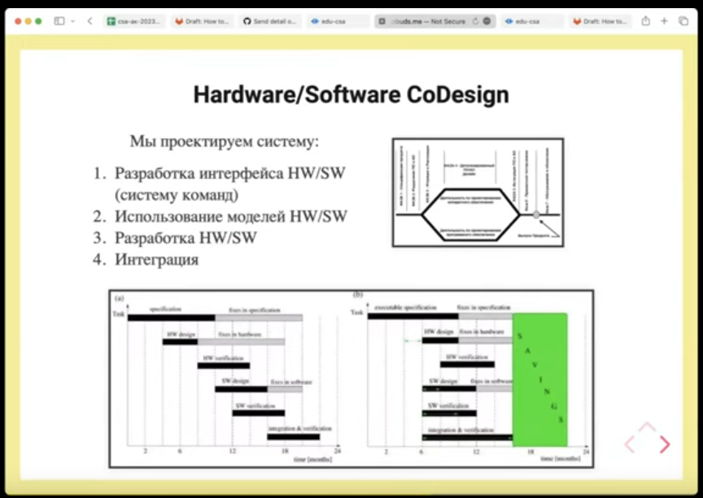

Вопрос_9. Понятие модели вычислений (MoC). Сопоставление понятия парадигмы программирования и MoC. Примеры MoC (последовательные, параллельные, функциональные) и их роль в разработке компьютерных систем. Использование MoC в разных вычислительных платформах.

MoC представляет язык для описания моделей процессоров/программ. Определяет возможности вычислительной машины. Характеризует, как исполняется программа(какие могут быть состояния вычислителя, их последовательность, правила переходов). МоС минималистичны относительно реальных вычислителей.

Таким образом, МоС хороши, чтобы понять какие-то основопологающие принципы работы системы, или оценить алгоритм. Пытаться экстраполировать МоС в полной мере на реальность не стоит. 

МоСы:
	
	Последовательные модели:
		Позволяют описать последовательный алгоритм, чьи составляющие могут быть сведены к последовательностям изменений состояния. (Пример - машина Тьюринга)

	Функциональные модели:
		Позволяют описать вычислительный процесс в символьной форме и как список правил. (Пример - Лямбда счисление, Комбинаторная логика)

	Параллельные модели:
		Применяются к системе, чей процесс работы включает в себя несколько взаимодействующих процессов. Эти процессы обычно описывает другая МоС. (Мобильная связь, синхронная передача данных)

	На основе этих моделей существуют распределённые модели. 

Близкие понятия МоС: парадигма программирования(Хотя все современные языки мультипарадигменны), Стиль программирования конкретного человека. 

По большому счёту, с МоС работают люди, разрабатывающие алгоритмы. 

МоС на практике:
	
	1. Computer Science - создание алгоритмов и формальных моделей
	2. Дизайн языков программирования
	3. Управление сложностью 
	4. Ограничение творческого порыва отдельных программистов
	5. Модель-ориентированная инженерия

### Вопрос_10. Универсальный процессор и его свойства. Машина Тьюринга и полнота по Тьюрингу. Виды процессоров (СБИС, FPGA, CGRA, GPU, DSP, CPU) и их сопоставление с точки зрения универсальности и эффективности.

Для реализации 2-ух этапной разработки, на стороне Hardware необходим так называемый универсальный процессор. 

Универсальный процессор - процессор, который позволяет решать широкий круг задач, настройка которых производится после производства "по месту" или в run-time.

Стоит отметить, что в данном случае универсальность не значит полноту по Тьюрингу. А также, что теоретическая универсальность не значит практическую. К тому же универсальность вредит эффективности. 

Свойства универсального процессора: 
	
	1. 2-ух этапное проектирование
	2. Полнота по Тьюрингу ???
	3. Отсутствие "серьёзных" ограничений на объём программы
	4. Изменяемость ПО

Можно сравнить разные существующие процессоры по соотношению эффективности и универсальности:
	
	Схема на кристалле (СБИС) - это тип процессора, который представляет собой полностью интегрированную схему, в которой все компоненты, включая процессорное ядро, память и периферийные устройства, расположены на одном кристалле. СБИС-процессоры обладают высокой производительностью и эффективностью, но они также являются дорогостоящими и сложными в разработке.

	FPGA - Программи́руемая по́льзователем ве́нтильная ма́трица, полупроводниковое устройство, которое может быть сконфигурировано пользователем или разработчиком после изготовления. Наиболее трудоёмкая в изготовлении среди ПЛИС. 

	CGRA - Coarse-Grained Reconfigurable Arrays. Похожи на FPGA, но выстраиваются из более комплексных блоков. 

	GPU - Graphics processing unit. Процессоры, созданные специально для проведения расчётов графики. Уже более универсальны, как показывала практика, могут использоваться и для других задач (Например для добычи криптовалюты).

	DSP - Цифровой процессор обработки сигналов

	CPU - Центральный процессор, наиболее универсальный из всего вышеперечисленного, но в конкретных задачах будет уступать специализированным. 

	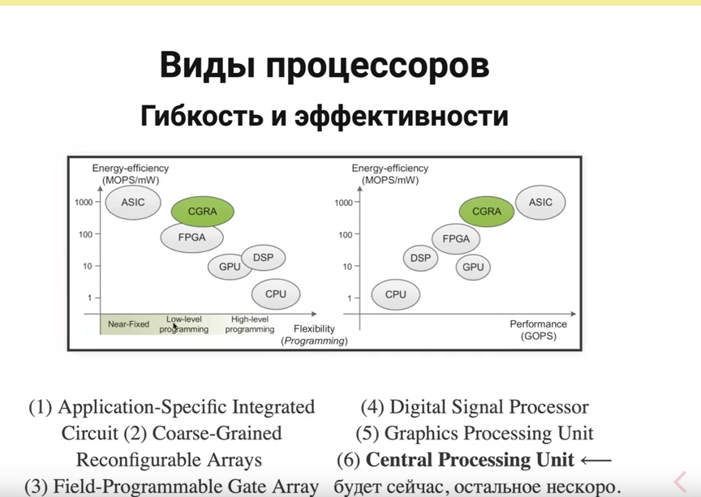

Можно отметить, что чем более процессор гибкий в своей конфигурации и программировании, тем менее эффективным он будет в работе с поставленными перед ними задачами. 

Машина Тьюринга - абстрактный исполнитель (абстрактная вычислительная машина). По факту просто каретка, бегающая по бесконечной ленте, с возможностью движения влево или вправо. Программа записывается на этой же ленте. Машина может прочитать за раз лишь 1 ячейку ленты. 

Полнота по Тьюрингу - означает возможность реализации функционала машины Тьюринга на компьютере/языке программирования. 

Микропроцессор - цифровая схема, которая выполняет операции с внешним источником данных (обычно памятью или потоком данных). 

Микроконтроллер - микросхема, предназначенная для управления электронными устройствами. Типичный микроконтроллер сочетает функции процессора и периферийных устройств.

### Вопрос_11. Архитектура фон Неймана. Принципы. Свойства. Особенности и ограничения. Применение на практике. Машинное слово. Понятие системы команд и её роль в построении процессоров. Control Unit и DataPath.

Архитектура процессора (architecture)
	то, как видит компьютер программист. Определена набором команд (язык), местом нахождения операндов (регистры и память) и вычислительными механизмами (кеш, прерывания...). 

Машина фон Неймана:
	
	1. Развитие машины Тьюринга. Ключевые отличия:
			лента заменена на Random-Access Memory (RAM);
			инструкции и данные объединены.
	2. Призвана быть максимально простой в реализации и производстве.

Особенности:
	
	1. Использование двоичного кодирования. (В наше время встречается троичное и двоично-десятичное кодирование)
	2. Программное управление. Команды выполняются последовательно. (В современных суперскалярных архитектурах последовательность и порядок условны)
	3. Память компьютера однородно хранит данные и программы (В современных компьютерах однородность условна)
	4. Ячейки памяти компьютера имеют адреса. RAM. (Сегодня память не является пассивным элементом компьютера)
	5. Возможность условного перехода (В современных компьютерах переходы могут происходить и по другим причинам (прерывания))

Виды инструкций:
	
	1. Работа с памятью (запись констант, копирование данных (память, регистры, порты I/O)).
	2. Арифметические, логические и битовые операции
	3. Управляющие операции (безусловный, условный и косвенный переходы, вызов и возврат из подпрограмм).
	4. Инструкции сопроцессоров (Загрузка и выгрузка данных. Управление сопроцессором.)

В текущем виде не применяется, но вклад неоценим. Все современные процессоры являются развитием архитектуры фон Неймана. 

Система команд процессора
	(Instruction Set Architecture — ISA) абстрактная модель процессора, формирующая интерфейс взаимодействия между программным обеспечением и процессором. 

Машинное слово
	фрагмент данных фиксированного размера, обрабатываемый как единое целое 

{???
Микроархитектура процессора (microarchitecture)
	соединение простейших цифровых элементов в логические блоки, предназначенные для выполнения команд определенной архитектуры.

	1. Описывает, как в процессоре расположены и соединены друг с другом регистры, АЛУ, конечные автоматы, блоки памяти, интерфейсы ввода-вывода и т.п.
	2. У каждой архитектуры может быть много микроархитектур, обеспечивающих разное соотношение производительности, цены, сложности, технической эстетики. Они смогут выполнять одни и те же программы.
	3. Если ISA и микроархитектура отличаются на уровне MoC — обычно требуется уровень виртуализации (ПО, аппаратура. транслятор...).
???}

Control Unit - Компонент CPU, направляющий работу процессора. Обычно использует бинарный декодер для конвертации закодированных инструкций в сигналы, которые руководят работой других компонентов процессора. 

Datapth - ALU, набор регистров, внутренние шины CPU, позволяющие данным проходить через них.

Работа Datapath в разных архитектурах - 
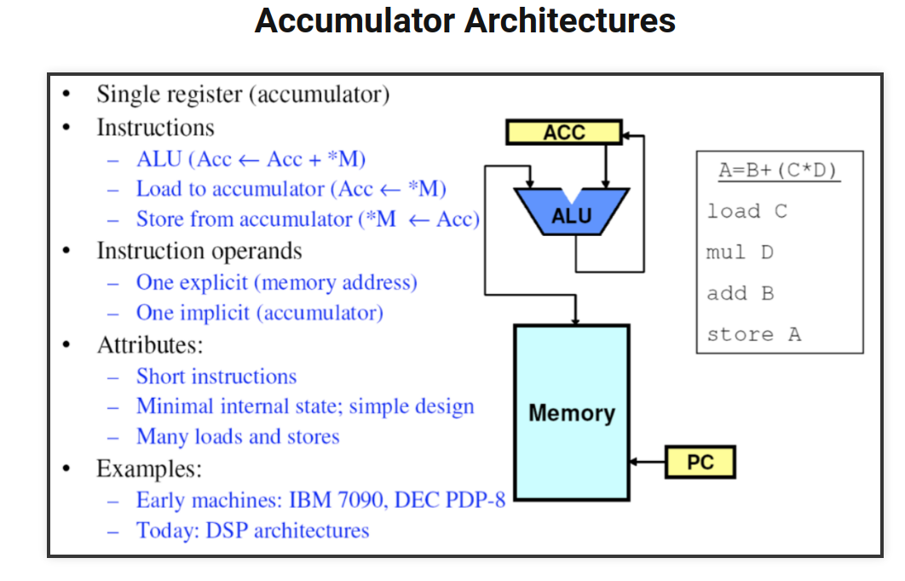
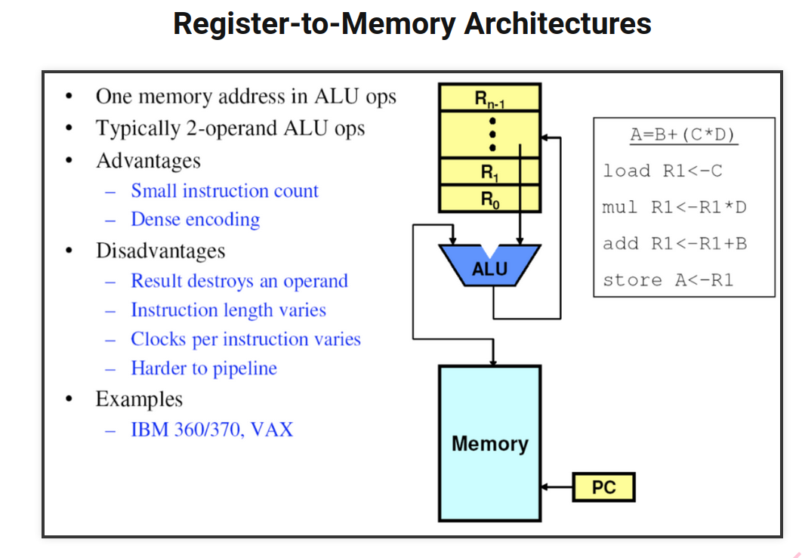
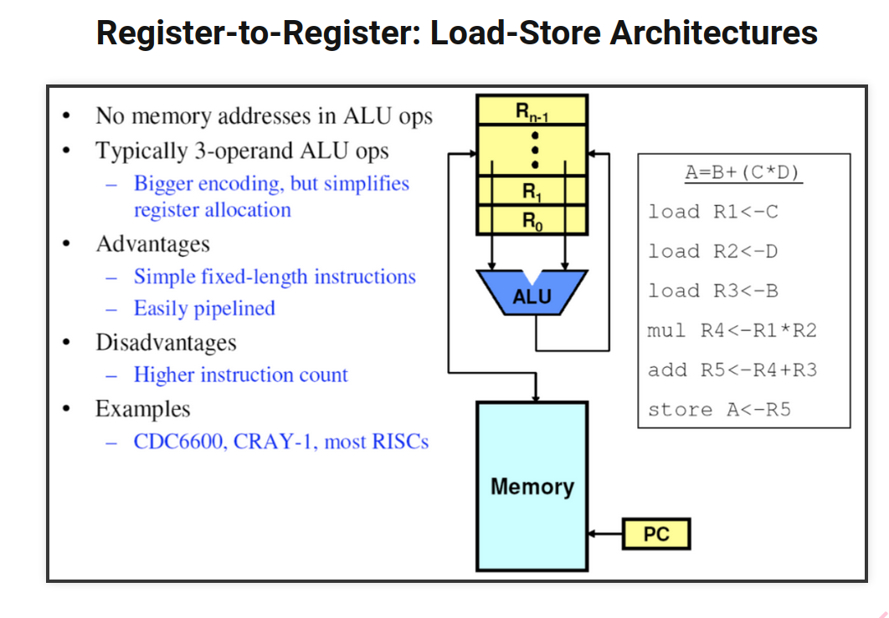
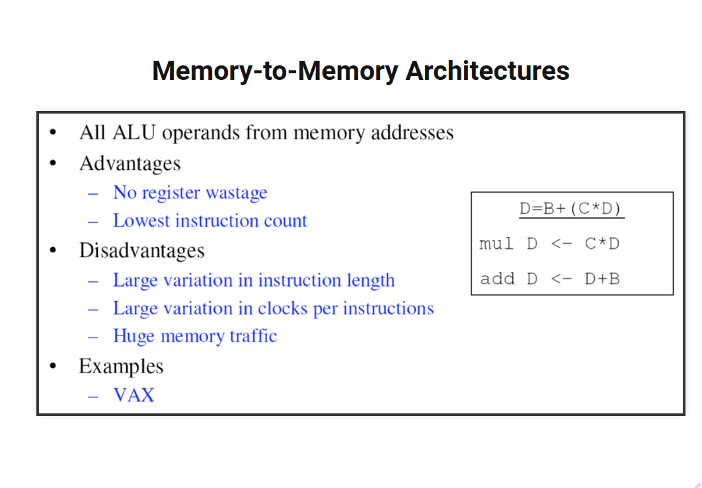
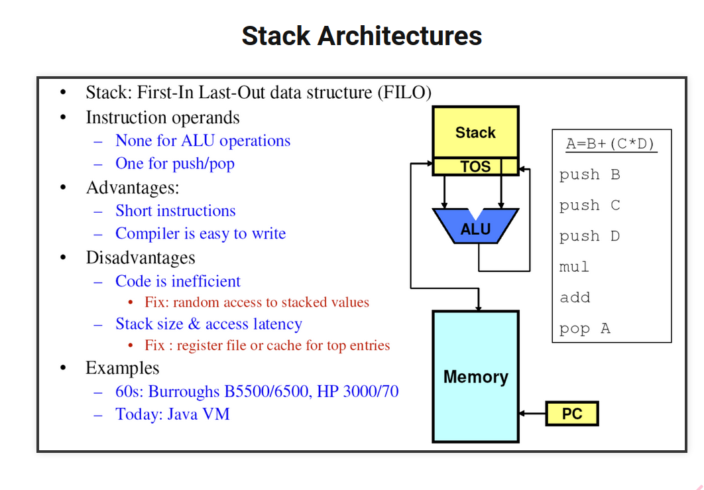

### Вопрос_12. Гарвардская архитектура и её отличия от архитектуры фон Неймана. Принципы. Свойства. Особенности и ограничения. Применение на практике. Подходы к обходу ограничений архитектуры. Машинное слово. Control Unit и DataPath.

Гарвардская архитектура - архитектура ЭВМ, отличительными признаками которой являются: хранение инструкций и данных представляют собой разные физические устройства, каналы инструкций и данных также физически разделены. 

В архитектуре фон Неймана процессор в один момент времени может либо читать инструкцию, либо читать/записывать данные в/из памяти. Оба действия происходить не могут, так как для них используется одна и та же шина. А процессор в компьютере Гарвардской архитектуры может считывать очередную команду и оперировать с памятью данных одновременно. Но при этом, схема работы процессора Гарвардской архитектуры, заметно сложнее оного архитектуры фон Неймана. 

Также недостатком классической Гарвардской архитектуры является сложность переноса данных, содержащихся в инструкциях в память и вставки новых данных в память инструкций. 

Таким образом, достоинства Гарвардской архитектуры:
	
	1. 2 физических канала между процессором и памятью
	2. Одновременный доступ к памяти команд и данных
	3. Разная ширина машинного слова и адреса для данных и программ
	4. Изоляция памяти инструкций

Недостатки:
	
	1. Сложность и стоимость реализации
	2. Изоляция инструкций и данных (Запуск результата компиляции и указатели на функции)

{???
Вариации Гарвардской архитектуры:

Архитектура "Память инструкций как данные"
(Instruction-memory-as-data)
	реализуется возможность читать и писать данные в память программ. Позволяет генерировать и запускать машинный код. 

Архитектура "Память данных как инструкции"
(Data-memory-as-instruction)
	реализует возможность запуска инструкций из памяти данных. Позволяет генерировать и запускать машинный код, но параллельный доступ ограничен. 

Модифицированная Гарвардская архитектура (main stream)
	Доступ к памяти реализуется через независимые кеши для данных и программ, за счет чего, с точки зрения внутренней организации процессора, доступ реализован независимо, при этом канал между процессором и 
???}

CU и Datapath см. Вопрос 11

### Вопрос_13. Механизм микроопераций, микропрограммирование и его роль в развитии компьютерных систем. Особенности и ограничения. Применение на практике. Пример оптимизации через микрокод. NISC архитектура.

Микроархитектура процессора

Микроархитектура процессора (microarchitecture)
	соединение простейших цифровых элементов в логические блоки, предназначенные для выполнения команд определенной архитектуры. 

Примечания:
	
	Описывает, как в процессоре расположены и соединены друг с другом регистры, АЛУ, конечные автоматы, блоки памяти, интерфейсы ввода-вывода и т.п.
	У каждой архитектуры может быть много микроархитектур, обеспечивающих разное соотношение производительности, цены, сложности, технической эстетики. Они смогут выполнять одни и те же программы.
	Если ISA и микроархитектура отличаются на уровне MoC — обычно требуется уровень виртуализации (ПО, аппаратура. транслятор...).

При реализации Control Unit существует 2 подхода:
	
	Hardwired - при помощи аппаратных комбинационных схем, декодирующих инструкции в последовательности сигналов.

	Microcoded - при помощи исполнения микропрограммы реализующей необходимые функции

	Микропрограмма(микрокод) - программа, реализующая набор инструкций процессора. 

Таким образом, комплексные инструкции внутри процессора разбиваются на простейшие микроинструкции, напрямую транслирующиеся в управляющие сигналы процессора.

Достоинства такого подхода: 
	
	1. Простота реализации (CISC).
	2. Возможность "программирования" системы команд.
	3. Доступ к микрокоду для программиста.
	4. Генерация ISA под задачу 

Недостатки подхода:
	
	1. Хранение микрокода в процессоре.
	2. CISC долго учить.
	3. Разнообразие архитектур → проблемы инструментария.
	4. Разнообразие команд (форматы, размеры, длительности, доступ). Усложняет: (оптимизацию процессора; инструментарий).
	5. Микрокод привносит проблемы ПО (сложность, отладка) в аппаратуру

No Instruction Set Computer
NISC - идея отказа от системы команд и реализации только микрокода. 

Применяются в ускорителях, спец. вычислителях, высокоуровневом синтезе

Достоинства NISC:
	
	1. Упрощение аппаратуры
	2. Максимальная эффективность программного управления
	3. Нет ISA, нет проблем её проектирования

Недостатки NISC:
	
	1. Невозможность бинарной совместимости (В подходе с микрокодом можно сколь угодно "перекапывать" микроархитектуру без угроз совместимости, пока она предоставляет тот же архитектурнй интерфейс)
	2. Низкая плотность машинного кода

### Вопрос_14. Что такое CISC? Роль в развитии компьютерных систем. Применение на практике. Достоинства и недостатки. Отличия от архитектуры фон Неймана. Особенности программирования.

CISC архитектура процессора (Complex Instruction Set Computer) - Архитектура процессора, в которой единичные инструкции могут представлять собой сразу несколько низкоуровневых внутренних операций процессора.

Например x86 - add qword [0x1234], 100 ; rep stosq

ARM - FJCVTZS %w0, %d1

Достоинства:
	
	1. Высокая плотность кода
	2. Комплексность инструкций позволяет сэкономить время выборки инструкций (вместо выборки и исполнения нескольких простых инструкций исполняется 1 сложная).
	3. Код для CISC архитектур интересно писать

Недостатки:
	
	1. Сложность экстраполяции всех правил программирования CISC архитектуры на компиляторы. 
	2. Сложное внутреннее устройство процессора и Contron Unit.

Какие-то отличия CISC от фон Неймановской архитектуры не выделить - CISC это про ISA, фон Нейман - про Memory layout. 

В CISC архитектурах нет фиксированной ширины инструкций.

Для конвейризации внутри реализуется управление на уровне микрокода. 

Раньше, в условиях слабых компиляторов и большого разнообразия архитектур, на рынке существовало много CISC архитектур. К сегодняшнему дню среди них осталась только x86. 

CISC VS Von Neuman (by GPT):
	
	CISC (Complex Instruction Set Computing) и Von Neumann Architecture (также известная как архитектура фон Неймана) - это две разные концепции в компьютерной архитектуре.

	CISC относится к процессорам, которые используют большое количество сложных инструкций, которые могут выполнять несколько операций за один цикл. Это позволяет сократить количество инструкций, необходимых для выполнения задачи, и ускорить работу процессора. CISC-процессоры также обычно имеют большой объем памяти на кристалле, что позволяет им хранить большое количество инструкций и данных.

	Архитектура фон Неймана, с другой стороны, является основой для большинства современных компьютеров. Она основана на идее того, что данные и инструкции хранятся в одной памяти и обрабатываются одним процессором. Это позволяет процессору быстро получать доступ к данным и инструкциям и обрабатывать их.

	Одним из основных отличий между CISC и фон Нейманом является то, что CISC-процессоры имеют многослойную архитектуру, в то время как архитектура фон Неймана является однослойной. Кроме того, CISC-процессоры обычно имеют большее количество регистров и специализированных инструкций, чем процессоры, основанные на архитектуре фон Неймана.

### Вопрос_15. Что такое RISC? Роль в развитии компьютерных систем. Применение на практике. Достоинства и недостатки. Отличия от архитектуры фон Неймана. Особенности программирования.

Risc - Reduced Instruction Set Computer

RISC находится в дихотомии с CISC. 

Предпосылки к появлению:

	1. Сложные операции встречаются редко и заменимы группами команд
	2. Качественно улучшение возможностей компиляторов

Особенности:

	1. Единый формат инструкций, простота декодера
	2. Место памяти микрокоманд и декодера можно использовать под инструкции и кеш
	3. Оптимизация малого количества однообразных команд
	4. Лёгкость конвейризации команд без нужды микрокода

Главные достоинства - параллелизм уровня инструкций, простота разработки процессора

RISC vs Von Neuman (by GPT):
	
	RISC (Reduced Instruction Set Computing) и архитектура фон Неймана - это две разные концепции в компьютерной архитектуре.

	RISC-процессоры, в отличие от CISC-процессоров, используют набор простых инструкций, которые выполняются за один цикл. Это позволяет ускорить работу процессора и уменьшить сложность его архитектуры. RISC-процессоры также обычно имеют меньшее количество регистров, чем CISC-процессоры.

	Архитектура фон Неймана, с другой стороны, является основой для большинства современных компьютеров. Она основана на идее того, что данные и инструкции хранятся в одной памяти и обрабатываются одним процессором. Это позволяет процессору быстро получать доступ к данным и инструкциям и обрабатывать их.

	Одним из основных отличий между RISC и архитектурой фон Неймана является то, что RISC-процессоры имеют более простую архитектуру, чем процессоры, основанные на архитектуре фон Неймана. Они также обычно имеют меньшее количество инструкций, чем процессоры, основанные на CISC-архитектуре. Кроме того, RISC-процессоры обычно быстрее работают с памятью и имеют более высокую скорость выполнения инструкций.

### Вопрос_16. Конвейеризированное исполнение команд. Стадии конвейера. Виды конфликтов (по данным, по управлению), их примеры и влияние на производительность. Достоинства и недостатки.

Конвейризированное исполнение команд - паралеллизм уровня инструкций. Идея заключается в разбиении инструкции на несколько этапов выполнения и выполнения этих этапов параллельно для разных команд. 

Стадии конвейра представляют собой такты. Один такт - одна стадия конвейра. 

Построение конвейра:
	
	1. Выделить стадии выполнения команд
	2. Организовать внутренние структуры процессора так, чтобы:
		У процессора был входной(поступают команды) и выходной конец(команды покидают процессор)
		Структурв процессора должна соответствовать стадиям выполнения команд
		Сегменты связаны регистрами, комбинационные схемы сбалансированы
		Все части процессора управляются одним тактовым сигналом
	3. загружать в процессор команды каждый такт
	4. Получать результаты выполнения команд каждый такт
	5. Разрешать конфликты выполняемых команд.

Типовые стадии конвейра RISC:
	
	1. Instruction Fetch (Чтение инструкции по счётчику команд)
	2. Instruction Decode (Декодировать инструкцию и считать регистры)
	3. Instruction Execute (Операций изменения данных)
	4. Memory Access (Чтение/запись операндов из памяти/в память)
	5. Write Back (Запись результата в регистры)
Для конкретики можно глянуть
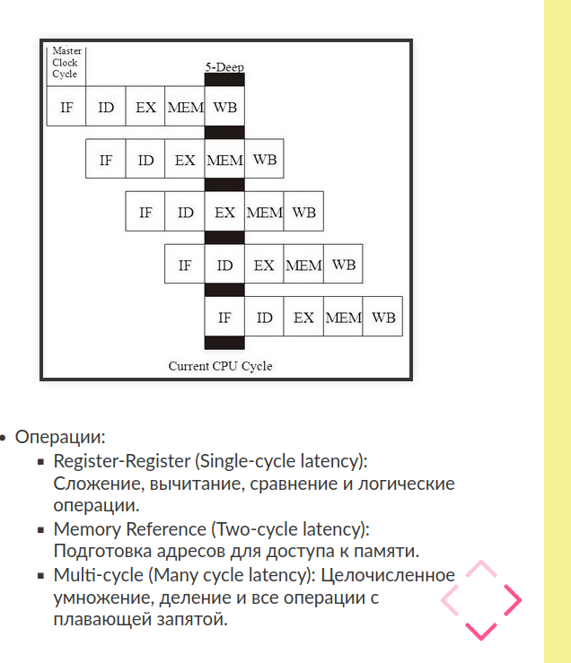

### Вопрос_17. Виды конфликтов при работе конвейера и механизмы их разрешения, сокращения их числа. Пузырёк, разворачивание циклов, предсказания переходов (статические и динамические).

	Виды конфликтов при работе конвейра: 
		1. Структурные конфликты (Structural dependency)
		2. Конфликты данных (Data dependency)
		3. Конфликты по управлению (Contral dependency / Branch hazard)

	Структурные конфликты:
		Конфликт из-за ресурсов. Аппаратура не позволяет выполнить все возможные комбинации инструкций.
		Пример: одновременный доступ к единой памяти команд/данных.
		Варианты решения проблемы:
			Гарвардская архитектура
			Двухпортовая память
		Разрешение конфликта пузырько
  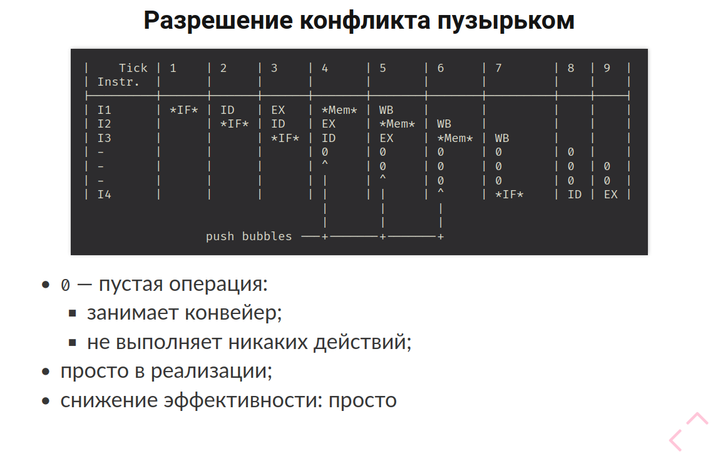

	Конфликты по данным (Hazards):
		RAW - Read after Write (and r1, 0xf; sub r0, r1)
		WAR - Write after Read - не проблема в общем случае (and r0, r1; sub r1, 100)
		WaW - Write after Write - (and r1, 0xf; sub r1, r0)
		RAR - Read after Read - не проблема (and r0, r1; and r2, r1)
		Разрешение:
			1. исполнение не по порядку. (out of order execution)
			2. Переминование регистров. Если зависимость по данным ложная, запись может быть переназначена на другой регистр.
			3. Вставка пузырька (плохо)
			4. Проброс операндов (bypassing, Operand Forwarding) между стадиями конвейра, минуя регистры 
   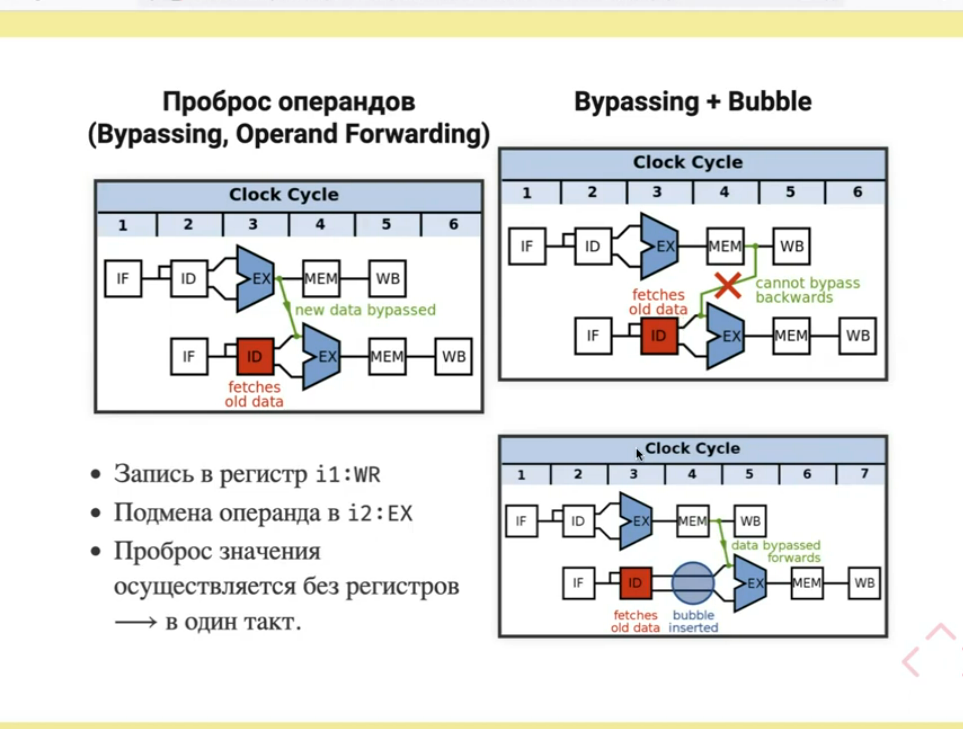

	Конфликты по управлению (Control Dependency, Branch Hazards):
		Конфликт из-за операций условного и/или безусловного перехода
		Проблема: в конвейр загружены команды, которые не должны быть исполнены
		Решения:
			bubble (плохо)
			сброс конвейра
			минимизация количества условных переходов (loop unrolling, условное перемещение данных)
			branch prediction (предсказание переходов)

Barnch prediction - предсказание результатов инструкций условного перехода

Статическое:
	1. Условный переход вперёд скорее не произойдёт (аля if)
	2. Условный перехлд назад скорее произойдёт (аля for)
	3. Некоторые процессоры поддерживают "подсказки" компилятора для предсказаний

Динамическое:
	Внутри процессора формируется таблица из адреса команды с переходом, адреса, предсказанного для перехода, и несколько бит, хранящих результат работы инструкции в прошлые её вызовы. Обычно используется счётчик с накоплением 2 бита. 

2-битовый счётчик называют Saturating counter. 00 - strongly not taken, 01 - weakly not taken, 10 - weakly taken, 11 - strongly taken.

Многоуровневое(Corellation based branch prediction):
	Многоуровневые предсказатели также называются двухуровневыми, так как они используют двумерную таблицу счётчиков, также называемую "Pattern history table". Значение, получаемые из таблицы - 2-битные счётчики. Таким образом, в эту таблицу записываются результаты перехода для предыдущих его вызовов. На основе данных о них, делается вывод о конкретном переходе, исполняемом конвейром. 
	Текст из википедии: (A two-level adaptive predictor remembers the history of the last n occurrences of the branch and uses one saturating counter for each of the possible 2n history patterns. This method is illustrated in figure 3.)

Преимущество конвейризации: повышение уровня производительности и уровня утилизации ресурсов

Недостатки:
	
	Снижение скорости исполнения отдельной команды
	Необходимость разрешения конфликтов
	Непредсказуемое время выполнения
	Уязвимости косвенных каналов (Spectre, Meltdown)

### Вопрос_18. Что такое SOP (Stack-Oriented Processors, стековый процессор)? Роль в развитии компьютерных систем. Применение на практике. Достоинства и недостатки. Отличия от архитектуры фон Неймана. Особенности программирования.

Не имеет регистров. Работает со стеком. У стека есть TOS(Top Of Stack), к которой обычно производится быстрый доступ. 

TOS обычно имеет размер 2, так как при реализации алгоритмов на стековой машине, зачастую работа ведётся с вершиной стека и следующим после неё элементом.

Часто имеет несколько стеков(для данных, для адресов возврата функций) 

Считается High-level language computer architecture.

Достоинства:
	
	1. легко реализовать процедуры, автоматическую память, рекурсию, сложные математические выражения со скобками, простой компилятор
	2. Простая система команд
	3. Cahce-friendly
	4. Threads

Недостатки:
	
	1. Большое количество данных на стеке крайне неудобно для программиста
	2. Обычно не прикрутить параллелизм уровня инструкций
	3. Не получится работать с динамическими структурами данных

### Вопрос_19. Поддержка операций ввода-вывода в фон Неймановских процессорах. Поддержка на уровне системы команд (порт, отображение в память). Программно-управляемый ввод-вывод. Ввод-вывод через механизм прерываний. Механизм прямого доступа к памяти.

Обычно внешнее устройство предоставляет процессору набор регистров, считывая и делая запись в которые по заданному протоколу, процессор может взаимодействовать, получать данные, отправлять данные и программировать устройство. 

Существует 3 варианта ввода-вывода:
	
	1. Программно управляемый - операции реализуются процессором. Все действия реализуются через инструкции процессора.
	2. Ввод-вывод по прерыванию - снимает с процессора задачу наблюдения и позволяет это реализовать по внешнему событию.
	3. Channel I/O и прямой доступ к памяти (Direct Memory Access — DMA) - процессор оповещается об операции завершения ввода-вывода.

С точки зрения ISA ввод-вывод реализуется либо через порты ввода-вывода (in/out в x86), либо через MMIO (Memory mapped input-output), когда регистры внешнего устройства привязываются к адресам в адресном пространстве процессора, то есть запись в память по этому адресу будет эквивалентна записи в регистр устройства, и наоборот с чтением. 

PMIO (Port Mapped Input Output):
	
	Достоинства:
		1. Минимизация логики управления (более простое адресное пространство портов)
		2. Ввод-вывод и доступ к памяти разделены
		3. Адресное пространство памяти остаётся однородно
	Недостатки:
		1. Усложнение ISA процессора
		2. Данные ввода-вывода - данные второго сорта(особенно для CISC cpu). с PMIO только in/out аналогично с RISC ld/st
		3. "Лишние" копирования данных
		4. Адресное пространство портов ограничено

MMIO (Memory Mapped Input Output):
	
	Достоинства:
		1. Может быть реализован без изменения микроархитектуры процессора
		2. Простота процессора
		3. Обработка данных без переноса в память
		4. Адресное пространство памяти огромно, количество устройств не ограничено устройством процессора
	Недостатки:
		1. Одна шина ввода-вывода и доступа к памяти
		2. Неоднородность памяти
		3. Устройства ввода-вывода работают с избыточным адресом
		4. Конфликты с кешами и параллелизмом уровня инструкций

Программно-управляемый ввод-вывод:
	
	Работа с вводом-выводом управляется единым потоком управления. Наблюдаем за состоянием устройства, реагируем.
	Проблемы:
		1. Занимает процессор
		2. Процессор должен регистрировать сигнал на частоте в два раза выше частоты сигнала (Теорема Котельникова)
		3. Высокое энергопотребление
		4. Как совмещать с другими задачами?
		6. Как быть со сложным протоколом ввода вывода?
Можно попытаться применить параллелизм через конечные автоматы, но это также будет давать свой overhead.

-------------------- ПРЕРЫВАНИЯ:

Ввод-вывод через прерывания:
Возможность совершить переход к другой части кода, реагируя на внешнее событие, и потом вернуться обратно. 
Принцип работы:
	
	1. Выполнение основного потока.
	2. Запрос прерывания.
	3. Сохранение адреса возврата.
	4. Вызов обработчика прерывания (ISR) — обычного кода в специальном месте.
	5. Завершение ISR.
	6. Восстановление адреса возврата.
	7. Продолжение основного потока.
Система прерываний обеспечивает минимум два уровня задач:
	
	1. Основной поток исполнения.
	2. Поток (потоки) обработчиков прерываний.
Источники прерываний либо аппаратные, которые, в свою очередь, могут быть внешними(асинхронные для внутренних циклов процессора)(тик таймера, нажатие клавиши) и внутренними(деление на 0, ошибка доступа к памяти), либо программными, то есть вызванными инструкцией. 

Для реализации прерываний обычно аппаратно реализуется контроллер прерываний.
В рамках контроллера реализуется конкурирующая очередь, где разным прерываниям присваивается разный приоритет.

Прерывания бывают маскируемыми и не маскируемыми(возможность отключать ненужные прерывания для сохранения целостности потока исполнения), относительными и абсолютными (прерывания прерываний)

Прерывания, получаемые контроллером бывают:
	
	1. По фронту. A key difference between the edge-triggered and level-triggered interrupts is interrupt sharing. Level-triggered interrupts can be shared. Edge-triggered interrupts cannot be shared(IBM doc).
	2. По уровню (требует "сброса"). By OR — Spurious Interrupts. The interrupt is triggered when the level changes (from inactive to active or asserted); until it's deasserted, the line remains in the asserted state.
	In short, edge interrupt gets fired only on changing edges, while level interrupts gets fired as long as the pulse is low or high.
	3. По сообщению (Message Signaled).
	4. По дверному звонку (Doorbell). Сигнал и информация разделены. (оповещение от устройства и начало работы со считыванием данных устройства не совпадают)

Пример контроллера прерываний и внешнего устройства: 8259 PIC и Intel 8253 в x86.

-------------------- КОНЕЦ ПРЕРЫВАНИЙ

Механизм прямого доступа к памяти:
Для DMA(Direct Memory Access) аппаратно реализуется сопроцессор, Контроллер прямого доступа к памяти. Он вместо cpu выполняет команды переноса данных между памятью устройств ввода-вывода и памятью процессора. 

Контроллер прямого доступа к памяти обычно сам реализован как устройство ввода-вывода. 
В зависимости от разновидности, управление контроллером может осуществляться как сами процессором(Third party), так и устройством ввода-вывода(Bus mastering).

Обычно контроллер прямого доступа памяти работает в одном из этих режимов:
	
	1.Пакетный режим (Burst Mode). Приоритет DMA.(Передача данных осуществляется единой операцией, которая не может быть прервана процессором).
	2. Циклический режим (Cycle stealing mode).Приоритет конфигурируется.(Для процессора и DMA выделяется фиксированный слот времени в рамках цикла).
	3. Прозрачный режим (Transparent Mode). Приоритет процессора.(Передача данных, когда процессор не взаимодействует с памятью).

Достоинства DMA:
	
	1. Скорость.
	2. Эффективность. Снижает нагрузку на процессор.
	3. Параллелизм: DMA может иметь несколько каналов для параллельной работы.
	4. Интерактивность, так как процессор разгружен от "рутины".

Недостатки DMA:
	
	1. Проблемы совместимости. (переферия cpu и память должны уметь с ним работать)
	2. Сложность при непоследовательном доступе к памяти.
	3. Ограниченный контроль за системной шиной. Синхронизация работы процессора и DMA.
	4. Конфликты использования DMA разными устройствами ввода-вывода.

### Вопрос_20. Параллелизм уровня задач. Кооперативная многозадачность. Принцип работы и подходы к реализации. Примеры использования. Достоинства и ограничения. Зелёные процессы. Проблема синхронизации процессов по управлению и по данным. Сравнение с альтернативами.

---------------- НАЧАЛО ОЧЕРКА О ПАРАЛЛЕЛИЗМЕ

Для начала стоит очеркнуть понятия Parallelism и Concurrency из английского языка. Parallelism подразумевает выполнение нескольких задач параллельно несколькими работниками, когда как Concurrency подразумевает выполнение нескольких задач параллельно одним работником.

Паралеллизм уровня задач в рамках архитектуры фон Неймана представить тяжело - машина фон Неймана рассчитана на единый поток инструкций, условно вечно выполняющийся процессором. 

Обеспечить параллелизм на уровне задач можно:
	
	1. Кооперативной многозадачностью(Cooperative multitasking), соответствующей архитектуре фон Неймана
	2. Вытесняющей многозадачностью(Preemptive multitasking)(Истинной многозадачностью)

---------------- КОНЕЦ ОЧЕРКА О ПАРАЛЛЕЛИЗМЕ

Кооперативная многозадачность - Многозадачность, при которой следующая задача выполняется, когда текущая задача явно объявит о готовности отдать процессорное время.

Кооперативная многозадачность получает все ресурсы компьютера. Фоновые задачи заморожены. Приложения делят процессор, передавая управление следующему.

Вычислительные механизмы кооперативной многозадачности:
	
	1. Механизм остановки выполнения задачи: добровольная передача управления "диспетчеру".
	2. Механизм сохранения состояния задачи: регистры, стек, состояния сопроцессоров, память, ввод-вывод, кеш, состояние предсказателя переходов, и т.п.
	3. Механизм планирования — какой задаче отдать процессорное время следующей.
	4. Механизм возобновления остановленного процесса: восстановление состояния и передача управления.
	5. Механизмы изоляции задач: независимое выполнение, безопасность.
	6. Механизмы взаимодействия между задачами: передача данных и сигналов, общие ресурсы.

Подходы реализации:
	
	1. Имитация через конечные автоматы. (осталась разве что во встроенных системах)
	2. С диспетчером задач на уровне ОС/VM/Программного кода

Практическое применение: 
		
	Пакетный режим и медленный ввод-вывод (в мейнфреймах), чтобы освободить процессор на время I/O.
	Простые встроенные системы, bare-metal программирование.
	Realtime. Статическое планирование.
	Оптимизации систем, требующих частого переключения задач (ngnix/apache)

Достоинства кооперативной многозадачности:
	
	1. Контроль за ресурсами со стороны задачи.
	2. Известные точки остановки. Отсутствие гонок.
	3. Легкость и эффективность (при программной реализации).

Недостатки кооперативной многозадачности:
	
	1. Контроль за ресурсами осуществляется задачей. (злоупотребление приводит к проблемам)
	2. Сбой задачи может быть глобальным.
	3. Низкая эффективность и трудоёмкость ввода-вывода.
	4. Сложность разработки интерактивных приложений

Зелёный процесс - виртуальный процесс, чьё вычислительное время регулируется библиотекой или виртуальной машиной, а не нативной ОС. Они используются для реализации многозадачности в однопоточных системах, или некоторых высокоуровневых окружениях вроде виртуальных машин некоторых языков программирования. 

### Вопрос_21. Параллелизм уровня задач. Вытесняющая многозадачность. Механизмы переключения задач. Примеры использования. Достоинства и ограничения. Проблема синхронизации процессов по управлению и по данным. Сравнение с альтернативами.

См. очерки о параллелизме в начале вопроса 20. 

Вытесняющую многозадачность также называют истинной.

В вытесняющей многозадачности ОС передаёт управление между программами в случае завершения операций ввода-вывода, событий в аппаратуре компьютера, истечения таймеров и квантов времени, поступления сигналов.

Распределение времени осуществляется планировщиком.

Переключение процессов происходит буквально между двумя любыми инструкциями 

Возможна мгновенная реакция на действия пользователя. 

Вычислительные механизмы вытесняющей многозадачности:
	
	1. Вместо механизма остановки задачи механизм прерывания процесса — забрать процессор у задачи независимо от её желания.
	2. Механизм сохранения состояния задачи: регистры, стек, состояния сопроцессоров, память, ввод-вывод, кеш, состояние предсказателя переходов, и т.п.
	3. Механизм планирования — какой задаче отдать процессорное время следующей.
	4. Механизм возобновления остановленного процесса: восстановление состояния и передача управления.
	5. Механизмы изоляции задач: независимое выполнение, безопасность.
	6. Механизмы взаимодействия между задачами: передача данных и сигналов, общие ресурсы.

### Вопрос_22. Система прерываний. Виды прерываний. Механизм обработки прерываний по шагам. Задачи, решаемые механизмом прерываний. Сторожевой таймер.

О прерываниях см. очерк в вопросе 19

Пример работы системы прерываний: Сторожевой таймер (Watchdog timer)

Сторожевой таймер - аппаратно реализованная схема контроля от зависания системы. 

Watchdog timer ждёт, в течении заданного промежутка, сигнала "жизни" от процессора. 
В случае, если процессор его не отправляет, таймер перезагружает устройство. 

### Вопрос_23. Параллелизм уровня задач. Проблемы совмещения, изоляции и взаимодействия задач между собой. Методы разрешения данных проблем (с точки зрения опыта программиста и пользователя): распределение по адресному пространству, банки памяти, сегментная организация памяти и виртуальная память.

См. очерки о параллелизме в вопросе 20

Параллелизм требует:
	
	1. Обеспечить совмещение и изоляцию между задачами.
	2. Обеспечить взаимодействие между задачами.

Случай работы без изоляции? Единое адресное пространство? (плохо)

Требуется изолировать:
	
	1. Адреса инструкций (переходы).
	2. И динамические библиотеки.
	3. Адреса статических данных и переменных.
	4. Динамическая память (куча).
	5. Автоматическая память (стек).

Вопрос изоляции памяти можно решить с помощью:
	
	1. Банков памяти (отчасти)
	2. Сегментации
	3. Виртуальной памяти

Банк Памяти - механизм подключения нескольких чипов памяти к процессору:

	Используется когда:
		1. Память имеет большее адресное пространство, чем процессор.
		2. Расширение машинного слова.
		3. Переключение режима работы (аппаратная изоляция).
		4. Изоляция задач — редко

Не является классичской изоляцией. Раньше мог использоваться для изоляции в системах без аппаратной поддержки оной. 

-------------------------- НАЧАЛО ОЧЕРКА О ВИРТУАЛЬНОЙ ПАМЯТИ И СЕГМЕНТАЦИИ

Сегментация - Разметим память процессора по назначению. Как внутри задач, так и между ними:
	
	1. Сегментная адресация памяти — способ логической адресации памяти, где адрес: сегмент + смещение.
	2. Сегмент — выделенная область адресного пространства определённого размера.
	3. Смещение — адрес ячейки памяти относительно начала сегмента.

Сегментация позволяет:
	
	1. Независимая адресация внутри сегментов (нет коллизиям).
	2. Управление доступом (чтение, запись). Запрет доступа к "чужим" сегментам.
	3. Взаимодействие задач через общий сегмент.
	4. Изоляция программных модулей, динамические библиотеки (ПО — 1, data — N).
	5. Перекрытие сегментов 

Достоинства сегментации:

	1. Таблицы сегментов относительно малы.
	2. Таблицы сегментов просты в обработке и перемещении.
	3. Средние размеры сегментов больше, чем размеры большинства страниц, что позволяет хранить в сегментах больше данных процесса.
	4. Отсутствует внутренняя фрагментация.

Недостатки сегментации:

	1. Сложна в поддержке со стороны компилятора, ПО.
	2. Использование требует участие программистов (количество сегментов, размер сегментов).
	3. Подвержена серьезной внешней фрагментации.
	4. На сегодня — считается устаревшей и имеет ограниченную поддержку со стороны ОС (Linux).

! Внутренняя фрагментация - когда выделяется больше памяти чем запрашивалось. Лишняя не используется.
! Внешняя фрагментация - свободная память в процессе выделения или освобождения разделяется на мелкие блоки и в результате не обслуживаются некоторые запросы на выделение памяти.

Виртуальная память - Предоставим каждой задаче своё независимое адресное пространство.
Пусть каждый процесс думает, что всё адресное пространство его:
	
	1.Разделяем виртуальное адресное пространство на страницы (все).
	2. Отображаем используемые страницы в физическую память. 32 бит адреса — 4 Гб.
	3. Если используемых страниц больше, чем физической памяти → выгружаем на диск до востребования.

Виртуальная память позволяет:
	
	1. Прозрачно для программиста изолировать задачи.
	2. Нелинейное физическое размещение данных.
	3. Не фиксировать объём памяти, используемый задачей.
	4. Использовать больше памяти, чем есть физически. Выгрузка на диск части задачи (задач).
	5. Права доступа. Отображение страниц на разные адресные пространства.

Достоинства виртуальной памяти:
	
	1. Прозрачна для программистов.
	2. Работа с "бесконечной" памятью, динамическое распределение памяти.
	3. Отсутствует внешняя сегментация.
	4. Повышает общую стабильность системы (аналогично вытесняющей многозадачности). (жадный процесс будет выгружен на диск).

Недостатки виртуальной памяти:
	
	1. Большой объём таблиц страниц, длительный поиск (кеш).
	2. Высокие накладные расходы (ввод-вывод, перенос страниц и т.п.)
	3. Не позволяет осуществить изоляцию внутри адресного пространства.
	4. Непредсказуемая длительность доступа к памяти.
	5. Высокая сложность реализации.

-------------------------- КОНЕЦ ОЧЕРКА О ВИРТУАЛЬНОЙ ПАМЯТИ И СЕГМЕНТАЦИИ

Взаимодействие между работающими задачами:
Типовые виды задач(условно):
	
	1. Main/kernel - исходный поток инструкций
	2. Прерывания - особый код обработчиков прерываний
	3. Потоки - работают в адресном пространстве процесса. Прямой доступ к его данным.
	4. Процессы - изолированные адресные пространства. Нет прямого доступа.
	5. Зелёные потоки - В рамках Run-Time или виртуальной машины.

Проблемы взаимодействия потоков между собой:
	
	1) непредсказуемая последовательность исполнения инструкций с недетерминированным результатом.
		Решение - искуственная синхронизация процессов:
			1. Атомарные операции: compare&swap, store conditional и т.п.
			2. Mutex (0/1), Semaphore (0..N).
			3. [Software] Transactional Memory ([S]TM).
			4. Process Network, Promise, Futures, Actor-Model..
	2) Проблема доступа к изолированной памяти
		Решение - инструменты для взаимодействия потоков, общие ресурсы:
			1. Shared Memory
			2. Signals
			3. IO: Network, Files, Pipes

### Вопрос_24. Сегментная и виртуальная память. Решаемые задачи и принципы работы. Проблема фрагментации. Достоинства и недостатки.
	
	СМОТРЕТЬ ОЧЕРК О ВИРТУАЛЬНОЙ ПАМЯТИ И СЕГМЕНТАЦИИ В ВОПРОСЕ 23

### Вопрос_25. Иерархия памяти (явная и скрытая). Виды памяти. Особенности использования на практике. Устройство памяти с произвольным доступом. Устройство и принцип работы ROM, SRAM, DRAM ячеек.

Иехрархия памяти в компьютерах(от самых дорогих и быстрых к медленным и дешёвым):
	
	- CPU и его составляющие
	- разновидности RAM
	- Solid State Drives
	- Mechanical Hard Drives
Куда-то сюда можно ещё впихнуть сетевые хранилища

Задачи хранения данных:
	
	1. Исходные данные, необходимые для запуска системы.
	2. Рабочие данные, создаваемые и изменяемые в процессе работы системы.

Проблема: с ростом скорости памяти растёт её стоимость (производство и размещение).
Почему она не решаема? Потому что если нам нужен большой объём быстрой памяти, то столкнёмся либо с её высокой стоимостью, либо с высокой стоимостью её размещения. Представим пример: изобретут новую память. Наша память будет вытеснена с рынка, и новая "быстрая" память займёт нишу. И внутри этой "быстрой" памяти уже будет условно медленная и быстрая. И мы опять зададим себе этот вопрос. 

Иерархия памяти с точки зрения разработчика: 

Явная иерархия памяти - регистры, DRAM, SRAM, диски, альтернативные хранилища. Посыл - используйте с умом.

Скрытая иерархия - Модель одна память, одно адресное пространство. Место реального хранения зависит от способа использования. Определяется прозрачно для разработчика. Послы: YOU WILL OWN NOTHING AND BE HAPPY.

Типы доступа к памяти:
	
	1. с произвольным доступом RAM. Задержка доступа не зависит от истории запросов.
	2. С последовательным (Жесткие диски, магнитные ленты) Задержка при смене адреса. Хорошая скорость последовательной записи/чтения.
	3. Гибридные (библиотека магнитных лент, векторные операции) экзотика...

RAM - Память с произвольным доступом. Доступ происходит так(4 слова на 3 бита. 2 битный адрес): | Адрес ячейки (2 бита) |,  |дешифратор (активирует линию 1 из 4) |, | линия активрующая ячейки требуемого машинного слова |, |линия, на которую выставляется/читается значение бита определённой позиции |, | ячейка памяти | ???

Типовые реализации ячеек памяти:
	
	1. на основе триггеров. Много транзисторов * бит, быстро, много $
	2. ROM. <=1 транзистор * бит, Read Only Memory. Просто за-hardco-женные значения аппаратуры.
	3. SRAM мало транзисторов * бит, очень быстро, 1000$ за ГБ
	4. DRAM 1 транзистор * бит, просто быстро, 10$ 10 ГБ
Обычно SRAM - внутри cpu, DRAM - та самая addressable RAM.

ROM - Read Only Memory. Реализует только чтение (bitline?????)
	
	Реализация:
		Физическое не-размещение транзисторов для записи на производстве
		Пережигание перемычек после однократного программирования(PROM)

SRAM - Static Random Access Memory
	
	Хранит данные с помощью группы транзисторов. 4 - инверторы, 2 - доступ
	Быстрый R/W
	Значение хранится до отключения питания
	Требует большое количество транзисторов (низкая плотность ячеек)

DRAM - Dynamic Random Access Memory
	
	Состояние памяти хранится в конденсаторе. 
	1. Состояние конденсатора считываемо лишь раз
	2. Состояние конденсатора утекае
	3. Требуется контроллер памяти для регенерации
		Увеличивет длительность доступа
		Блокирует доступ к памяти во время регенерации
	4. Один транзистор и конденсатор на ячейку памяти

В эру до 8086 процессоров существовала отдельная техника оптимизации кода - расположение обращений к памяти между регенерацией DRAM, вызывающейся контроллером (DRAM Refresh)(так как если обращение попадало на Refresh, то программа ждала его завершения прежде чем выполнить операцию над памятью). Но, уже во времена 8086, DRAM Refresh стал происходить настолько прозрачно для программиста и эксплуататора компьютера, что как-либо синхронизировать с ним свой код стало в общем невозможным. 

### Вопрос_26. Механизм кеширования в компьютерных системах, принцип локальности. Функционирование кеш памяти процессора (чтение, запись). Виды кеш промахов.  Механизм вытеснения (LRU, PLRU).

Кеш - промежуточный буфер с быстрым доступом, содержащий информацию, которая может быть запрошена с наибольшей вероятностью. 

Свойства:
	
	1. Малый объём быстрой памяти для текущих данных
	2. Целесообразен, если доступ к памяти неравномерный
	3. (реже) Смена интерфейся: процессор - кеш - память

Кеши в компьютерных системах применяются на всех уровнях, но в данном случае идёт речь о процессоре.

Противоречие:
	
	1. Много данных. Кеши работают плохо, так как имеют низкую временную или пространственную локальность. То есть кеш не ускорит программу, которая редко один и тот же раз обращается к одной и той же памяти, но при этом, в таком случае, его потребление будет высоко.
	2. Кеши работают хорошо, когда локальность высока. При этом большая часть кеша простаивает. То есть, если программа часто обращается, к одному и тому же участку памяти, то кеш будет эффективен, и при этом, его расход будет низким. 

Кеш. Функционирование
	
	1. Кеш состоит из набора кеш-линий (блоков кеша, записей). 
	2. Кеш-линия ассоциирована с элементом в медленной памяти
	3. кеш-линия имеет идентификатор (тег), определяющий соответствие
	4. Доступ к памяти реализуется прозрачно для программиста
	5. Память может быть изменена вне зависимости от кеша (DMA, другое ядро)

Кеш. Чтение данных:

	1. Тег найден -> кеш-попадание. Данные читаются в процессор из кеша
	2. Тег не найден -> кеш-промах. Запрашиваем данные из памяти или следующего кеша. Выбираем линию для замещения:
		Если пустая - подходит
		Все заняты - принимаем решение о вытеснении линии
		Длительность получения данных произвольна - т.к. возможен многоуровневый кеш, возможна блокировка памяти
	Уровень попадания(hit rate) - основная характеристика эффективности кеша.

Кеш. Запись данных(кеш попадание):
	
	1. Немедленная запись (Write through). Изменение вызывает синхронное обновление памяти. Иногда медленнее чем без кеша.
	2. Отложенная запись (Write back). Обновление памяти при вытеснении кеш линии, периодически, или по запросу.
		Требует хранения признака модификации ("грязный")
		Два обращения: запись вытесняемого и чтение необходимого
		Группировка изменений, сокрытие промежуточных состояний
		Возможно неконсистентное состояние кеша и памяти. Для процессора - невидимое, для других устройств (DMA) - требуется принудительная запись. 
	3. Гибридные варианты. Пример: немедленная запись с буферизацией

В архитектуре x86 для конфигурации режимов кеширования регионов памяти, существует группа model-specific регистров, называемых MTRR. 

Кеш. Запись данных(кеш промах):
	
	1. Запись с размещением (Write allocate, fetch on write).
		Данные загружаются в кеш, после в них вносится исправление
		Поведение аналогично промаху по чтению
	2. Запись без размещения (No-Write Allocate, Write Around)
		Запсиь производится напрямую в память или через буфер

Кеш-промахи. Разная информация и операции:
	1. чтение данных - средняя задержка. Может компенсироваться параллелизмом уровня инструкций.
	2. Запись данных - минимильная задержка. Запись может быть отложена
	3. Чтение инструкций - большая задержка. ПРоцессор простаивает в ожидании инструкции. 

Кеш. Внутреннее устройство:
	
	1. Поиск кеш-линии по тегу (компораторы)
	2. Вытеснение, replacement (определение нужной кеш-линии)
	3. Предзагрузка (prefetch) данных и инструкций
	4. Взаимодействия с памятью (группировка операций и т.п.)
	5. Синхронизаций кешей разных уровней
Больше данных -> больше логики
Масштабирование по времени и площади

2 линии, 2 компаратора -> 1 такт
2 линии, 1 компаратор -> 2 такта

Кеш. Вытеснение и замещение
	
	1. Ключевой механизм: эвристика выбора более не требующейся кеш-линии среди доступных
	2. В процессорах применяются достаточно простые алгоритмы - Least Recently Used(LRU) и Pseudo-LRU
	3. Возможные модификации: Victim cache - сперва отделить, потом вытеснить(отдельная линия для вытесняемой записи). Запрет кеширования(если мы знаем, что наша память не локальна и не кешируется, то можно запретить кеш перед доступом). 

Pseudo-LRU:
	
	1. бинарное дерево
		Вершины хранят путь:
		left(0) / right(1);
		листья - кеш-линии
	2. Поиск записи для вставки или вытеснения:
		спуск по дереву согласно значениям в вершинах
		инверсия всех пройденных вершин
	3. Кеш попадание - инверсия пути от корня до листа
	4. Значительно "легче" LRU

### Вопрос_27. Устройство кеш-памяти процессора. Ассоциативность кеш-памяти (полностью ассоциативная, прямое отображение, множествено-ассоциативный кеш). Принципы работы. Детальное описание принципов работы кеш-памяти с разными вариантами ассоциативности.

Смотреть вопрос 26 про кеш. 

Ассоциотивность кеш памяти(поиск кеш линии по тегу) - это политика размещения данных памяти в кеше для оптимизации поиска.
Аналогия: поиск в массиве O(n), btree O(log(n)), hashmap O(1)-O(n)

Тег - идентификатор области памяти, сохранённой в кеш-линии

Что же хранить как тег?
Варианты:
1. Полный адрес - плохо, много памяти, много больших компараторов
2. Младшие биты - не нужны, если работать с блоками, а не байтами
3. Средние биты - Циклически повторяются в адресах памяти
	Принцип временной и пространственной локальносто
4. Старшие биты - Относительно уникальны, если используются

Полностью ассоциативный кеш(храним старшие и средние биты как тег):
	
	любая строка памяти может быть отображена в любую кеш-линию
	1. Лучшая эффективность
	2. Очень много логики у компараторов и вытеснения

Кеш с прямым отображением(Direct mapping):
	
	Каждая ячейка может быть отображена только в 1 кеш линию (одна кеш линия - много ячеек)
	Средняя часть - номер линии
	Средние биты адреса используются как индекс для кеш памяти
	Старшие биты используются как тег
	https://en.wikipedia.org/wiki/Cache_placement_policies
	1. Меньше памяти для тегов
	2. Один меньший компаратор
	3. Нет вытеснения (однозначно)
	4. Коллизия и техническая выгрузка

Множественно-ассоциативный кеш:
Кеш с прямым отображением (1 банк), воспроизведённый N раз
	
	1. Больше ассоциативность, ниже скорость, выше эффективность
	2. Выбор банка осуществляется на основе алгоритма вытеснения

### Вопрос_28. Иерархия кеш-памяти процессора. Причины множества уровней кеша. Разделённый/унифицированный, включающий/исключающий, частный/общий. Типовые уровни кеша в современных процессорах.

Смотреть вопрос 26 про общую информацию о кеше

Зачем нужно много уровней кеша?
	
	Разный кеш имеет разный размер и разную стоимость. Таким образом, не помешало бы иметь несколько для разных задач. 

Свойства кеша определяются:
	
	1. технологией ячеек памяти
	2. устройством кеша (размер, ассоциативность и т.д.)

Задачи кеша:
	
	1. Повышение скорости доступа 
	2. Синхронизация проц. ядер
	3. Оптимизация интерфейсов

Способы организации многоуровневых кешей:
	
	1. Разделённый/унифицированный (разеляем ли мы данные лежащие в разных кешах)
	2. Включающие/исключающие (может ли быть уместным дублирование данных)
	3. Частные/общие (сколько ядер имеют доступ)

Разделённый(Banked)/Унифицированный(Unified) - Кеш-память может быть реализована одним или несколькими банками памяти. Иметь один канал доступа, или несколько.

	Принцип разделения:
		По типу данных (кеш данных, инструкций, микрокода)
		По процессорному ядру
	Достоинства разделённого кеша:
		Высокая скорость (много каналов)
		Возможность адаптации устрйоства кеша под специфику использования
	Недостатки разделённого кеша:
		Усложнение процессора
		Конфликты между банками кеш памяти
В общем, разделённый кеш это круто, но он очень сильно усложняет устройство компьютера. Примерно как с Гарвардской архитектурой. 

Включающий/Исключающий кеш:
Должен ли кеш одного уровня включать в себя кеш другого уровня?(как регистры в x86)
	
	1. Включающая(Инклюзивная) - данные кеш-линий дублируюся. Доступ происходит быстрее. Выгрузка L1 не может привести к выгрузке L2, но часть памяти теряется
	2. Исключающая(Эксклюзивная) - данные не дублируются, память используется эффективнее.
	3. Гибридный вариант (NINE(Non-Inclusive, Non-Exclusive))

Частный(Private)/Общий(Shared) кеш:
характеризует доступ процессорных ядер к хешу

	1. Частный кеш - ядро имеет эксклюзивный доступ к кешу
		скорость ядра
		дублирование и конфликты
	2. Общий кеш - несколько ядер имеет доступ к кешу
		меньше кеш промахов
		нет дублирования
		постоянная синхронизация доступа

В современных компьютерах тип кеша рознится от уровня к уровню.

Уровни кеширования в современных процессорах:
	
	L0(опционален) - специальный кеш для: стека, int/float чисел. Обычно доступен за такт.
	L1 - быстрый, неотъемлемая часть cpu. Обычно разделён(Banked)
	L2 - Обычно часть cpu. 128 Кб - 12Мб. Обычно общий(Shared)
	L3 - до 24 Мб и более. Синхронизация данных в многоядерных cpu. (для переключения процессов ОС)
	L4 (экзотика для серверов и мэйнфреймов). Оптимизация интерфейса доступа к памяти

### Вопрос_29. Когерентность кеш-памяти. Возможные состояния кеш линий. Механизмы обмена информацией между кешами: справочник, отслеживание и перехват. CAP теорема.

Смотреть вопрос 26 про общую информацию о кеше. 27 о типах кеша.

Когерентность памяти (в информатике) — свойство компьютерных систем, заключающееся в том, что два или более процессора или ядра могут получить доступ к одной области памяти.

Возможные состояния кеш линий(MOESI):
MOESI — протокол поддержки когерентности кэшей микропроцессоров.
	
	1. Modified. L - свежие уникальные данные
		Модификация возможна без запросов
		L -> Exclusive (запись в память)
	2. Owned. Только одная запись в состоянии
		L - свежие данные, C - Возможны, M - может устареть
		L -> Modified (∀C -> Invalid) или -> Shared (запись в память)
	3. Exclusive. L, M - Свежие данные, C - нет
		L -> Modified (Записать в кеш) или L -> Invalid в любой момент
	4. Shared. Содержит свежие данные могут быть копии
		Запись запрещена, требуется L -> Exclusive, ∀C -> Invalid.
		L -> Invalid в любой момент
	5. Invalid. Не содержит корректных данных
	(L - кеш линия, C - копия кеш линии в другом cpu, M - запись в памяти)

Обмен информацие между кешами о состоянии кеш-линий:

Общий справиочник с информацией о разделяемых данных (Справочник/Directory):
    
	Перед загрузкой записи осуществляется проверка через справочник
	При изменении каталог либо обновляет либо аннулирует другие кеши с этой записью
	Достоинства:
		масштабирование, количество процессоров может быть велико
	Недостаток:
		задержка запроса по справочнику

Отслеживание(Snooping):
	
	Отслеживание операций других процессоров с памятью. 
    
	Кеши отслеживают адресные линии на предмет обращений к данным своих кеш линий.
	Если наблюдается запись - кеш помечает линию как "не актуально"
	Достоинство: скорость
	Недостаток: ограниченная масштабируемость (если 2 процессора то в целом неплохо, но вот например с 16 процессорами будет ужас - каждому из них нужно каждый такт общаться с остальными 15ю)
    
Перехват(Snarfing):
	
	Кеши отслеживают адресные линии и линии данных на предмет обращений к данным своих кеш линий
	Если наблюдается запись - кеш обновляет кеш линию
Самый быстрый но тяжёлый. Не просто кто что делает с записями, а дублируем изменения в свой кеш. Появляются новые шины данных, растёт сложность. 

К кешу ораниченно применима CAP теорема. 
CAP теормема: В распределённых системах нельзя одновременно обеспечить:
	
	1. Согласованность(Consistency) - каждое чтение получает последнюю запись или ошибку
	2. Доступность (Availability) - каждй запрос получает ответ (без ошибок), но и без гарантии, что он содержит последнюю запись
	3. Устойчивость к разбиению (Partition Tolerance) - система продолжает работать, несмотря на произвольное количество потерь в сети между узлами.

### Вопрос_30. Закон Мура. Закон Деннарда. Закон Амдала. Их роль в развитии компьютерных систем. Источники роста производительности процессоров тогда и сегодня.

Зако́н Му́ра (англ. Moore's law) — эмпирическое наблюдение, изначально сделанное Гордоном Муром, согласно которому (в современной формулировке) количество транзисторов, размещаемых на кристалле интегральной схемы, удваивается каждые 24 месяца. Часто цитируемый интервал в 18 месяцев связан с прогнозом Давида Хауса из Intel, по мнению которого, производительность процессоров должна удваиваться каждые 18 месяцев из-за сочетания роста количества транзисторов и увеличения тактовых частот процессоров[1]. 

https://ru.wikipedia.org/wiki/%D0%97%D0%B0%D0%BA%D0%BE%D0%BD_%D0%9C%D1%83%D1%80%D0%B0

Закон масштабирования Деннарда — эмпирический закон о прогрессе вычислительной техники: «уменьшая размеры транзистора и повышая тактовую частоту процессора, возможно пропорционально повышать производительность». 

https://ru.wikipedia.org/wiki/%D0%97%D0%B0%D0%BA%D0%BE%D0%BD_%D0%BC%D0%B0%D1%81%D1%88%D1%82%D0%B0%D0%B1%D0%B8%D1%80%D0%BE%D0%B2%D0%B0%D0%BD%D0%B8%D1%8F_%D0%94%D0%B5%D0%BD%D0%BD%D0%B0%D1%80%D0%B4%D0%B0

Зако́н Амдала (англ. Amdahl's law, иногда также Закон Амдаля — Уэра) — иллюстрирует ограничение роста производительности вычислительной системы с увеличением количества вычислителей. Джин Амдал сформулировал закон в 1967 году, обнаружив простое по существу, но непреодолимое по содержанию ограничение на рост производительности при распараллеливании вычислений: «В случае, когда задача разделяется на несколько частей, суммарное время её выполнения на параллельной системе не может быть меньше времени выполнения самого медленного фрагмента»[1]. Согласно этому закону, ускорение выполнения программы за счёт распараллеливания её инструкций на множестве вычислителей ограничено временем, необходимым для выполнения её последовательных инструкций. 

https://ru.wikipedia.org/wiki/%D0%97%D0%B0%D0%BA%D0%BE%D0%BD_%D0%90%D0%BC%D0%B4%D0%B0%D0%BB%D0%B0

### Вопрос_31. Проблема обеспечения реального времени в современных компьютерных системах. Влияние параллелизма уровня инструкций, языков программирования высокого уровня, многозадачности и организации памяти.

Реальное время - предсказуемая работа в заданный промежуток времени. 

В современных компьютерных системах присутствует в лучшем случае условно. 

Проблемы с предсказуемостью начинаются на уровне выполнения инструкций - конвейризация подразумевает параллельное или частично параллельное выполнение инструкций, что не даёт нам понять, конкретно когда конкретно какая инструкция выполняется.

Память в современных компьютерах поддерживается кешем процессора, поэтому скорость доступа к ней может сильно разниться (cache hit/miss)

Также к виртуальной памяти сейчас может быть привязано примерно что угодно. Например, там могут распологаться регистры ввода-вывода внешнего устройства. Время доступа к ним будет отличаться от времени доступа к RAM, но со стороны программиста это всё ещё выглядит как обращение к памяти.

После этого, операционная система обеспечивает вытесняющую многозадачность, динамически разделяя время работы процессора между задачами, что очевидно означает, что нормально измерить работу отдельного процесса мы не сможем. 

### Вопрос_32. Уровневая организация компьютерных систем. Элементы уровня организации. Уровневый архитектурный стиль. Примеры. Явление разделения на уровни (disaggregation) и их смешения. Документирование инструментальных цепочек.

Зачем уровневая организация? - Обеспечить модульность, вариативность.

Пример уровневой организации - модель OSI

Уровни организации выч. процесса:
	
	1. Layered project organization
	2. Frameworks, библиотеки API
	3. Языки программирования
	4. Операционные системы
	5. Системы команд (ISA), ПЛИС
	6. Виртуализированные ресурсы

Разделение на уровни (Disaggregation):
	
	Интегрированные решения (in-house какой-то компании). Уровни переплетены и адаптированы
	Уровни разделены по индустриям/специальностям
	Эффект масштаба
	Независимое существование. Закон Мура.
    
	Раньше компьютерные системы производились компаниями-гигантами IBM, HP, и т.д.
	Со временем требования к компьютерам росли
	Теперь компьютерные системы производятся по частям специализированными компаниями (Disaggregation)
	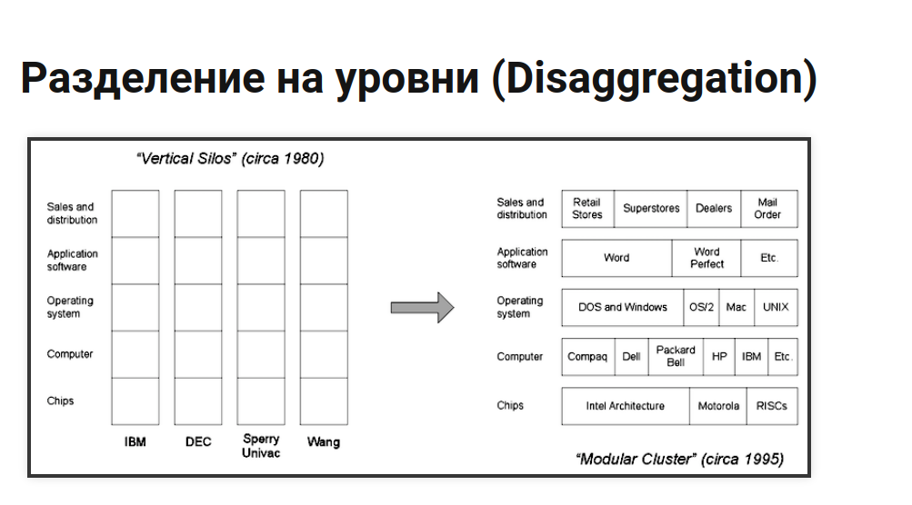

Смешение уровней. Интеграция.
В наше время, для продолжения развития компьютерных систем, ввиду их сложности, прошлые 2 подхода начинают смешиваться. in-house проектирование идёт рука об руку с уровневой архитектурой.
	
	1. Зачем: для обеспечения системных характеристик: энергопотребление, реальное время, производительность
	2. Смешение уровней -> рост связанности и сложности системы
	3. Смешение уровней при разработке
	4. Сквозные инструментальные решения

Как документировать уровневую компьютерную архитектуру?

Граф актуализации:
	
	1. Цепочка преобразований моделей выч. процесса через:
		1. стадии жизненного цикла (Design -> Dev -> Use)
		2. Вычислительные платформы (High -> Low-level Langs -> ISA -> HW -> Physics)
	Ориентированный ациклический граф, вепшины - модели, рёбра - трансляции/интерпретации
	Назначение: анализ инструментальных цепочек 
	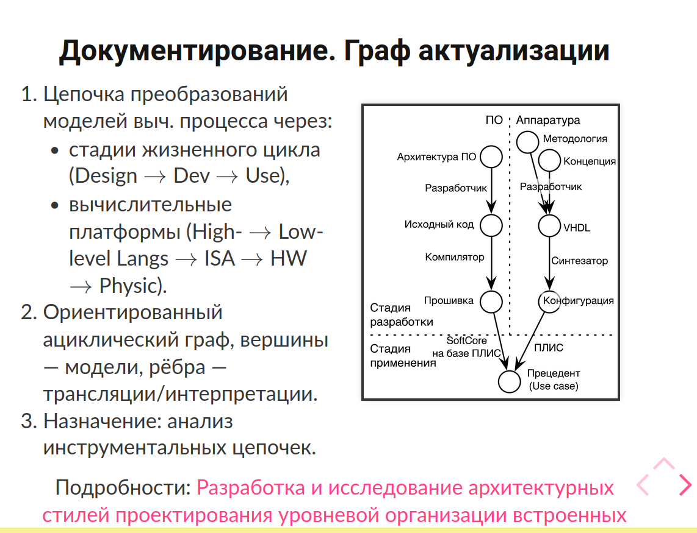

### Вопрос_33. Особенности реализации структурного программирования в фон Неймановских процессорах. Работа с памятью, регистрами. Реализация процедур. Реентерабельность.

Основной вопрос - трансляция языков выс. уровня в фон Неймановский машинный код 

Языки высокого уровня вместо переходов используют структурные блоки и их последовательность.

	1) Естественные элементы для архитектуры фон Неймана:
		последовательный код
		условный оператор
		циклы
		подпрограммы
	То, что реализует высокоуровневый язык:
	2) Расположение регистров
		Выражения(statement(if for...))
	3) Процедуры, области видимости, динамическая и автоматическая память
	4) Исключения, состояния и перезапуски (на усмотрение)
	5) Полиморфизм. Замыкания (на усмотрение)

Распределение регистров. Выражения. :
	
	Проблемы: кол-во регистров ограничено. Не все регистры одинаковы
	Это проблемы компилятора или программиста низкого уровня
	Код не ограничевается выражениями
	Компилятор должен имплицировать переменные в программе на доступные регистры.

Подпрограммы. Процедуры. :
	
	1. точка возврата фиксирована
	2. Память выделена статически
	3. Реализация:
		inline
		goto
		call ret
	4. Зачем?
		Переиспользование машинного кода
		Оптимизация работы кеша инструкций (код процедуры)
	5. Нет реентерабельности
	6. Проблемы:
		кеширование
		сброс регистров
		переходы и конвейр

Реентерабельность. Рекурсивный вызов:
	
	Реализация:
		Статическое выделение памяти для каждого входа (делать такое руками очень трудно, компилятору сложно)
		Автоматическая память, стек
	Зачем? переиспользование машинного кода (run-time), рекурсивные алгоритмы
	Проблемы: автоматическая память, утечки данных, перезапись адреса возврата
Чинится stack frame. ???

### Вопрос_34. Уровни параллелизма. Параллелизм уровня бит. Низкоуровневый параллелизм. Параллелизм уровня инструкций. Параллелизм уровня задач. Примеры и особенности.

Параллелизм бывает нескольких уровней:
	
	Уровня бит
	Низкоуровневый (данныхб инструкций)
	Уровня нескольких cpu
	Высокоуровневый (задач)	

По факту, настоящим параллелизмом являются только первые 3. Высокоуровневый так или иначе скорее Concurrency. 

Параллелизм уровня бит - вид параллельных вычислений, основанный на увеличении размера машинного слова. Условно можно сказать, что это не является параллелизмом с точки зрения устройства cpu, так как, во времена, когда они были много медленнее чем современные, различные арифметические и логические инструкции имели разную скорость работы в зависимости от количества значащих бит в операндах. Но даже тогда это изменение во времени работы было достаточно малым. Если говорить с сегодняшней перспективы, то внутри одного регистра, работа с битами, с точки зрения архитектуры, ведётся параллельно. Также к параллелизму уровня бит можно отнести SIMD.

Низкоуровневый параллелизм - конвейризация инструкций и выполнение их паралельно по частям. Также включает отделение от ЦПУ средств ввода-вывода (DMA). И наличие нескольких функциональных узлов в cpu для выполнения операций одновременно.

Параллелизм уровня нескольких cpu - включение в процессор нескольких идентичных ядер, способных одновременно выполнять инструкции независимо друг от друга. 

Высокоуровневый параллелизм - параллелизм уровня задач. Запуск теми или иными средствами нескольких независимых программ, работающих одновременно. 

### Вопрос_35. Параллелизм уровня инструкций. Суперскалярные процессора. Особенности и принципы работы. Сравнение с VLIW и практика использования. Достоинства и недостатки. Барьеры памяти.

Параллелизм уровня инструкций - конвейризация, их параллельное выполнение.

Процессор, поддерживающий параллелизм на уровне инструкций называют суперскалярным

Но у суперскалярных процессоров есть свои проблемы:
	
	Разные операции выполняются в разное время (сумма деление)
	Конвейр простаиват во время длинных потоков инструкций
	Решение:
		Анализ потока инструкций на лету, автоматическая параллелизация инструкций прозрачно для программиста.

Скалярная величина - величина, которая может быть предсавлена числом (целым или с плавающей точкой)

Идея суперскалярного процессора - несколько алу, которые могут работать параллельго с несколькими скалярами. 

Структура:
	
	1. Инструкции извлекаются в очередь команд по порядку
	2. Из очереди они декодируются и перемещаются на станции резервирования
	3. Станции резервирования эффективно выполняют переупорядочивание:
		Инструкции выполняются по мере доступности данных
		Доступность данных редко совпадает с порядком инструкции в очереди

Недостатки:
	
	1. Конфликты по данным между инструкциями приводят к усложнению процессора
	2. От него растёт энергопотребление
	3. Проблемы детерменированности работы многоядерных процессоров

Преимущества:
	
	1. Рост производительности
	2. Повышение уровня загрузки ресурсов
	3. Совместимость с существующим машинным кодом
	4. Компилятор может устранить значительное количество конфликтов за счёт сортировки инструкций

Барьер памяти - вид барьерной инструкции, которая приказывает компилятору (при генерации инструкций) и центральному процессору (при исполнении инструкций) устанавливать строгую последовательность между обращениями к памяти до и после барьера. В x86 - mfence

Все обращения к памяти перед барьером будут гарантированно выполнены до первого обращения к памяти после барьера. 

### Вопрос_36. Параллелизм уровня инструкций. VLIW процессора. Особенности и принципы работы. Сравнение с суперскалярными и практика использования. Достоинства и недостатки. Барьеры памяти.

См. Вопрос 35 о параллелизме инструкций. и 34 о параллелизме в целом.

Основоной проблемой суперскалярности является невозможность нормальной параллелизации автоматически процессором в run-time - из-за каких-то зависимостей какие-то функциональные модули компьютера всегда будут простаивать. Можно попробовать проектировать программы таким образом, чтобы минимизировать зависимости, но на современных архитектурах это достаточно трудно сделать. 

VLIW: упростим процессор за счёт переноса параллелизма инструкций в compile-time!

VLIW (Very Long Instruction Word - очень длинная машинная команда) - архитектура процессоров, характеризующаяся возможностью объединения нескольких простых команд в так называемую связку. Входящие в нее команды должны быть независимы друг от друга и выполняться параллельно. Таким образом, из нескольких независимых машинных команд транслятор формирует одно «очень длинное командное слово».

Объеденим несколько инструкций в одну.

Уберём из процессора все механизмы перестановки инструкций

Компилятор имеет полный доступ к инструкциям -> может "выжать" весь возможный параллелизм

Программа на VLIW - 
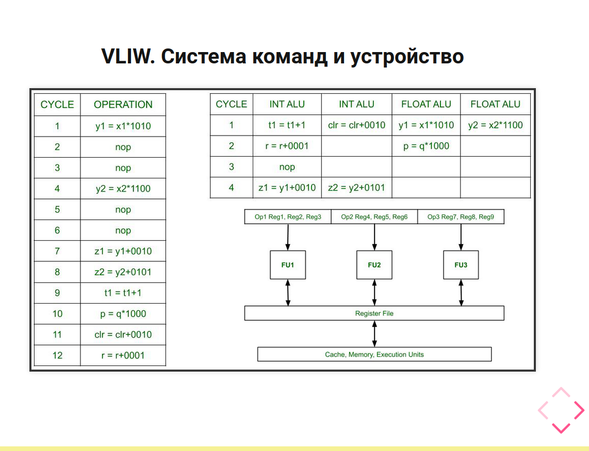

Достоинства:
	
	1. Упрощение процессора.
	2. Упрощение декодера, рост частоты

Недостатки:
	
	1. Невероятно сложный процесс написания компилятора
	2. Также очень сложно писать руками код на ассемблере, требует долгого обучения
	3. Высокая нагрузка на каналы данных, регистровые файлы
	4. Низкая плотность кода
	5. Ширина команды - ограничение микроархитектуры
	6. конфликты в широкой инструкции приводят к простою конвейра.

Если говорить о сравнении VLIW и суперскалярных архитектур, то у каждой есть плюсы и минусы.
Суперскаляры в целом лучше для общих задач. VLIW - для специализированных. 

Уровневая организация суперскаляр и VLIW - 
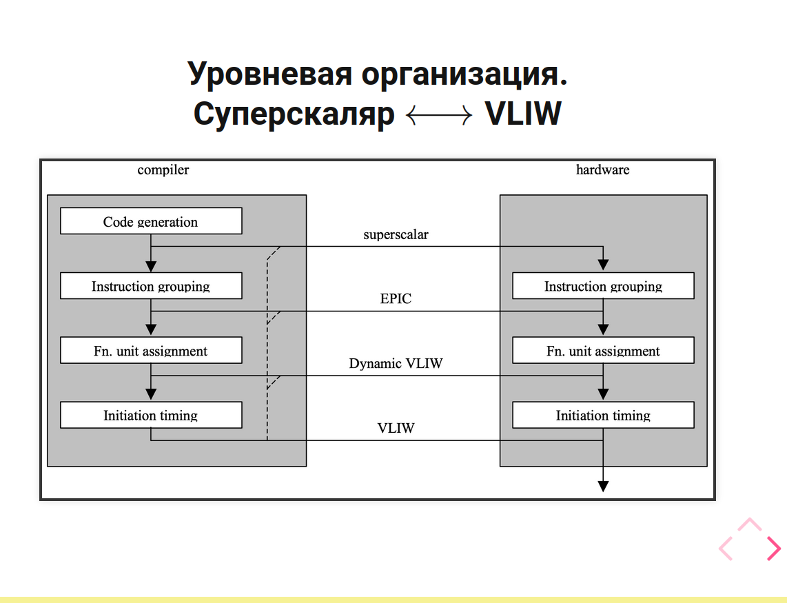
EPIC - https://ru.wikipedia.org/wiki/EPIC_(%D0%B0%D1%80%D1%85%D0%B8%D1%82%D0%B5%D0%BA%D1%82%D1%83%D1%80%D0%B0_%D0%BC%D0%B8%D0%BA%D1%80%D0%BE%D0%BF%D1%80%D0%BE%D1%86%D0%B5%D1%81%D1%81%D0%BE%D1%80%D0%B0)

### Вопрос_37. Программируемые логические контроллеры (ПЛК). Область применения. Особенности. Языки программирования.

Программы аппаратного толка: Некоторые разновидности программируемых компьютеров функционируют как их аппаратные прототипы серди них: ПЛК и ПЛИС. ????

Грубо говоря мы пытаемся разрабатывать аппаратуру условно так, как если бы мы писали ПО. 

Программируемые логические контроллеры(ПЛК):
	
	специальная разновидность электронной вычислительной машины. 
	Особенности:
	    являются законченными и самостоятельными устройствами;
	    работа в реальном времени;
	    эксплуатация в тяжёлых условиях;
	    ориентированы на работу с машинами и механизмами.
https://ru.wikipedia.org/wiki/%D0%9F%D1%80%D0%BE%D0%B3%D1%80%D0%B0%D0%BC%D0%BC%D0%B8%D1%80%D1%83%D0%B5%D0%BC%D1%8B%D0%B9_%D0%BB%D0%BE%D0%B3%D0%B8%D1%87%D0%B5%D1%81%D0%BA%D0%B8%D0%B9_%D0%BA%D0%BE%D0%BD%D1%82%D1%80%D0%BE%D0%BB%D0%BB%D0%B5%D1%80
Создавались для упрощения автоматизации на предприятиях
Исторически их работу выполняли релейные схемы
Недостатки релейных схем:
	
	Плохо масштабируется
	сложная настройка и поддержка
	низкая надёжность сложных схем
	проблема соостетствия документации и факта

ПЛК уже не мессиво из проводов, а конроллер.

Особенности ПЛК:
	
		Законченное и самостоятельное устройство
		Работа в реальном времени
		Эксплуатация в тяжёлых условиях
		Ориентированы на работу с машинами и механизмами

Устройство ПЛК -
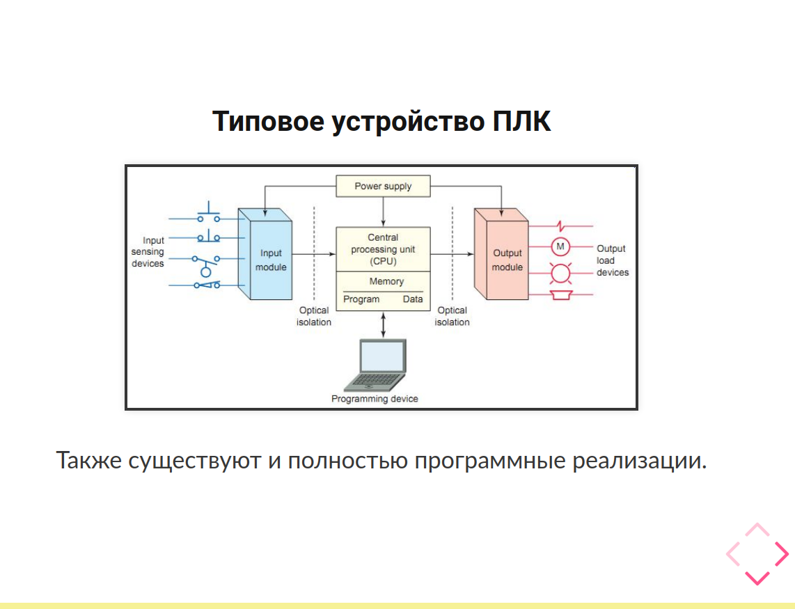

Программирование ПЛК -
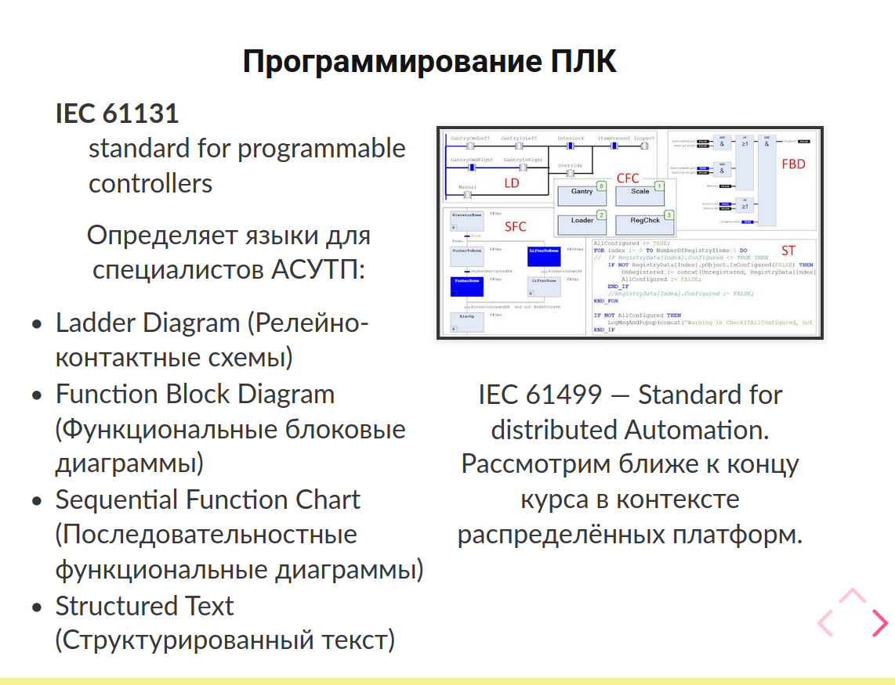

Вычислительные системы специального назначения. 

Работа в реальном времени!!! (предсказуемый результат в ограниченное время)

### Вопрос_38. Программируемые логические интегральные схемы (ПЛИС). Область применения. Особенности. Устройство. Задачи высокоуровневого синтеза, достоинства и недостатки.

Хитрые цифровые схемы, которые можно программировать без производственных инструментов. 

ПЛИС - интегральная микросхема, используемая для создания конфигурируемых цифровых электронных схем. 
Логика работы задаётся посредством программирования, а не при производстве.
Для формирования конфигурации используется специальное ПО и HDL: Verilog, VHDL...

Код переводится в набор эквивалентных булевых схем, после чего полученная схема отображается на плату. 

Конфигурация ПЛИС определяет, какие логические ячейки и модули процессора, как друг с другом связаны. Логические блоки становятся внутренними lookup tables. 

С одной стороны ПЛК и ПЛИС - аппаратные структуры, т.к. физически ими представлены и работают по правилам аппаратуры. С другой стороны, процесс их конфигурации чисто программный. 

проблемы:
	
    Существуют варианты реализаций алгоритма в цифровую схему.
    Выбор зависит от ограничений, накладываемых на схему.
    Изменение ограничений может вызвать перепроектирование.
    Разработка схем трудоёмка и требует специалистов.

Высокоуровневый синтез - генерация описания микроархитектуры на VHDL/Verilog по описанию, Представленному программой на языке C, с указанием необходимых для работы ограничений. 

Диаграмма высокоуровневого синтеза -
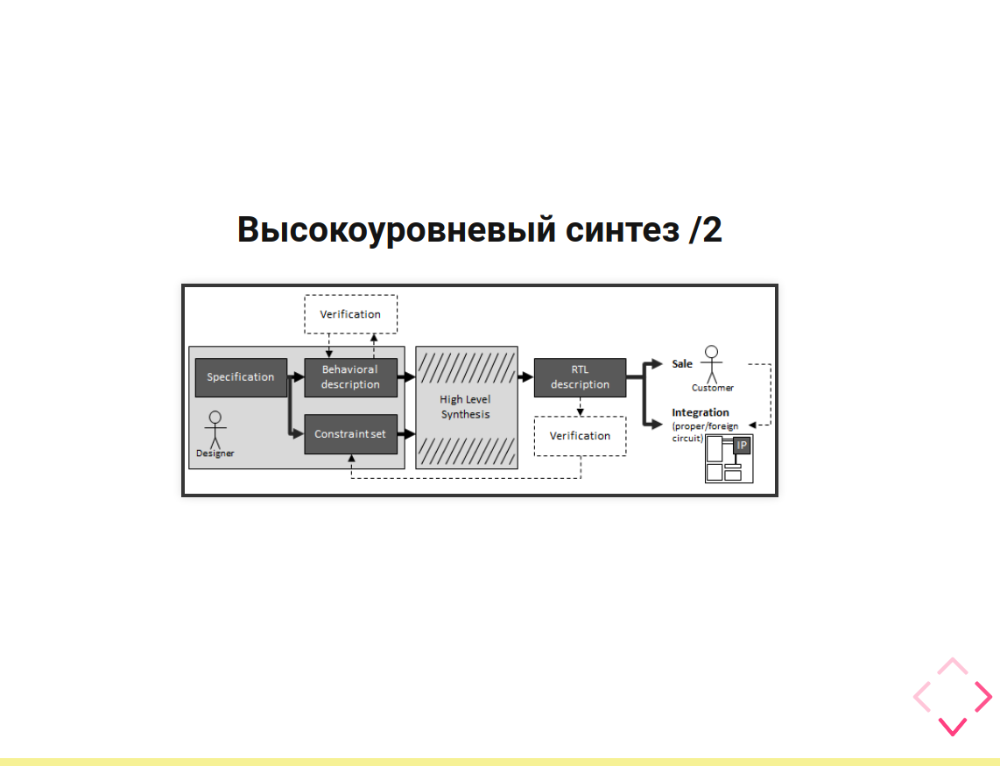

Достоинства высокоуровневого синтеза:
	
    Скорость проектирования. Быстрое прототипирование.
    Переносимость между разными целевыми платформами.
    Адаптируемость микроархитектуры под новые условия.
    Автоматизация процесса оптимизации схемы.

Недостатки высокоуровневого синтеза:
	
    Ограниченный контроль за результатом синтеза. "Чудеса". Абстракция всегда означает уменьщение контроля за тем, что происходит.
    Кривая обучения (специальность HLS Engineer) Ввиду прошлого пункта, HLS инженеры учатся долго
    Уровень зрелости технологии сильно варьируется:
        верификация результата;
        стабильность работы.

### Вопрос_39. Классификация Флинна. Выделяемые классы и примеры машин этих классов. SIMT архитектура.

Рост производительности:
Ограничения: Деннард(частота), Мур, Амдал (Параллелизм)

Перспективы: Специализация, Адаптация структуры под задачу и параллелизм, Реконфигурация

Классификация параллельных процессоров (Таксономия Флинна):
	
	Особенности Таксономии Флинна:	
    	количества потоков инструкции, количества потоков данных.
		Достоинства: простая и понятная.
		Недостатки:
		Не применима к не фон Неймановским архитектурам.
		Перегруженность класса MIMD

SISD (Single Instruction Single Data):
	
    Простой последовательный процессор.
    Абсолютное большинство рассмотренных ранее процессоров.
    Включая процессора с низкоуровневым параллелизмом.

SIMD (Single Instruction Multiple Data):

    Одновременное выполнение несколькими процессорами одной инструкции (Lockstep execution).
    Назначение: однообразная обработка множества наборов данных.
    Пример: GPU, поиск блока для BitCoin, мат. моделирование.
    Ключевое ограничение: операции ветвления. (когда одному из Processing Units нужно уйти в ветвление)  https://stackoverflow.com/questions/14098602/control-flow-divergence-in-simt-and-simd

SIMT (Single Instruction Multiple Threads):
	
    Расширение SIMD, позволяющее работать с оператором ветвления.
    Широко применяется в современных GPU и GPGPU (CUDA).
    Включает механизмы синхронизации потоков между собой, для достижения lockstep execution.
    Stackoverflow about CUDA SIMT:
    With SIMD if you have a routine where some elements need to be handled differently from other elements, then you need to explicltly take care of masking operations so that they are only applied to the correct elements. With CUDA's SIMT architecture you get the illusion of control flow on each thread, so you don't need explicit masking of operations - this still happens "under the hood" of course, but the burden is lifted from the programmer.

MISD (Multiple Instruction Single Data):
	
	Очень специфичная штука по классификации Флинна. Класс создан только исходя из критериев классификации. Может быть применена разве что для тестирования и верификации. 
    Один поток данных обрабатывается разными наборами инструкций.
    Обычно, выделяется для полноты классификации.
    На практике — повышение надёжности работы систем. Защита от ошибок проектирования и алгоритмов. Параллельная разработка и эксплуатация решений задачи.

MIMD (Multiple Instruction Multiple Data):
	
	Под определение вполне попадают современные суперскалярные процессоры - у них много ядер, у ядер свои инструкции и кеши.
    Множество процессоров автономно выполняют различные инструкции над различными данными.
    Самый разнообразный класс процессоров по классификации Флинна.
    Не выделяются подвиды, поэтому будут рассмотрены в контексте классификации Дункана.

Проблема Таксономии Флинна - почти любой современный cpu попадает в категорию MIMD. 

### Вопрос_40. Классификация Дункана. Цели и задачи, классификация первого уровня. Синхронные архитектуры (векторные, SIMD, ассоциативные массивы, систолические). Принципы их работы и примеры.

Ввиду перегруженности таксономии Флинна, на её основе была создана классификация Дункана.

Задачи:
	
	1. Абстрагироваться от низкоуровневого параллелизма.
	2. Переиспользовать элементы таксономии Флинна (1966).
	3. Актуализировать и включить новинки (1990).

Достоинства: относительная полнота
Недостатки: сложности, "искуственность" (много разных исключений)

Критерии классификации Дункана:
	
	1. Синхронные архитектуры - Параллельные архитектуры с единым механизмом управления (глобальные часы, центральный блок управления и т.п.). Различаются механизмами синхронизации.
	2. MIMD архитектуры - Параллельные архитектуры, которые могут исполнять независимые потоки инструкций. Потоки инструкций исполняются автономно, требуется динамическая синхронизация. Различаются структурой организации памяти.
	3. MIMD парадигма - Архитектура MIMD процессора определяется структурой и MoC. MoC определяет характер потоков данных, принципы взаимодействия и синхронизации. Различаются MoC.
	Первые 2 - об аппаратуре, 3 - об архитектуре, стоящей на ней. 

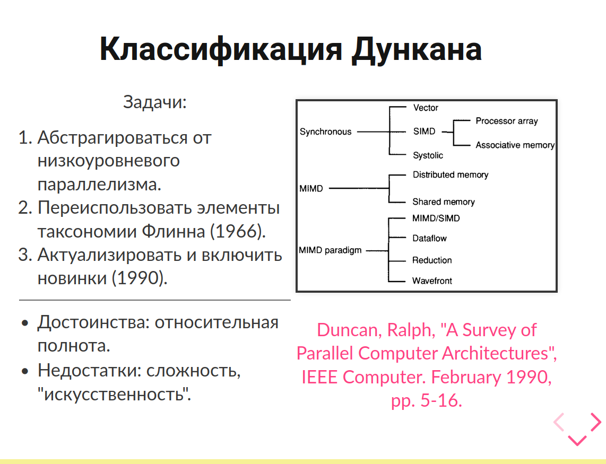

Идёт фокус на систему команд при оценке архитектуры. 

Синхронные архитектуры - Параллельные архитектуры с единым механизмом управления (глобальные часы, центральный блок управления и т.п.). Различаются механизмами синхронизации.

Синхронные архитектуры Sync. Векторные архитектуры:

Есть единая точка, которая дерижирует всей системой.

Скалярная величина - величина, которая может быть представлена числом (целочисленным или с плавающей точкой)

Вектор/Кортеж - величина, представленная последовательностью упакованных скалярных величин. 

Векторные операции — операции, выполняемые на последовательностях данных.

Особенности векторных архитектур:	
	
	1. Сокращение количества обрабатываемых команд.
	2. Конвейерное исполнение векторных операций.
	3. Множество функциональных узлов.

Обычно имеют свой собственный АЛУ для векторных операций. 

Другой пример SIMD - процессорные массивы.

ещё есть Ассоциативные массивы. SIMD строится не вокруг процессоров, а вокруг ассоциативной памяти.

Ассоциативная память (АП) или ассоциативное запоминающее устройство (АЗУ) — специальный вид машинной памяти, используемый в приложениях очень быстрого поиска. Известна также под терминами «память, адресуемая по содержимому», «ассоциативное запоминающее устройство», «контентно-адресуемая память» или «ассоциативный массив», хотя последний термин чаще используется в программировании для обозначения структуры данных (Hannum и др., 2004). 

Позволяет быстро искать информацию в массивах данных. 

Sync. Систолические архитектуры:
	
	Конвейрные мультипроцессоры:
		1. данные ритмично поступают из памяти,
		2. проходят через !сеть! процессоров,
		3.     и возвращаются в память.
	Синхронизация — через глобальные часы, такт.
	!Процессора объединенные жёсткими локальными связями, и каждый цикл процессора выполняют короткие неизменные операции.

### Вопрос_41. Классификация Дункана. Цели и задачи, классификация первого уровня. MIMD архитектуры (распределённая и разделяемая память). Примеры и принципы их работы.

Смотреть начало вопроса 40 про Классификацию Дункана

MIMD - В отличие от SIMD дерижёра нет. Процессоры должны взаимодействовать друг с другом, чтобы "понять, что им нужно делать".

Распределённая память:
	
    Координация совместной работы через прямое взаимодействие процессоров.
    Данные/сигналы явно передаются между процессорами (message passing).
    Мотивация: обеспечить масштабируемость многопроцессорной архитектуры и доступ к локальным данным процессора.
Распределённая память. Топология:
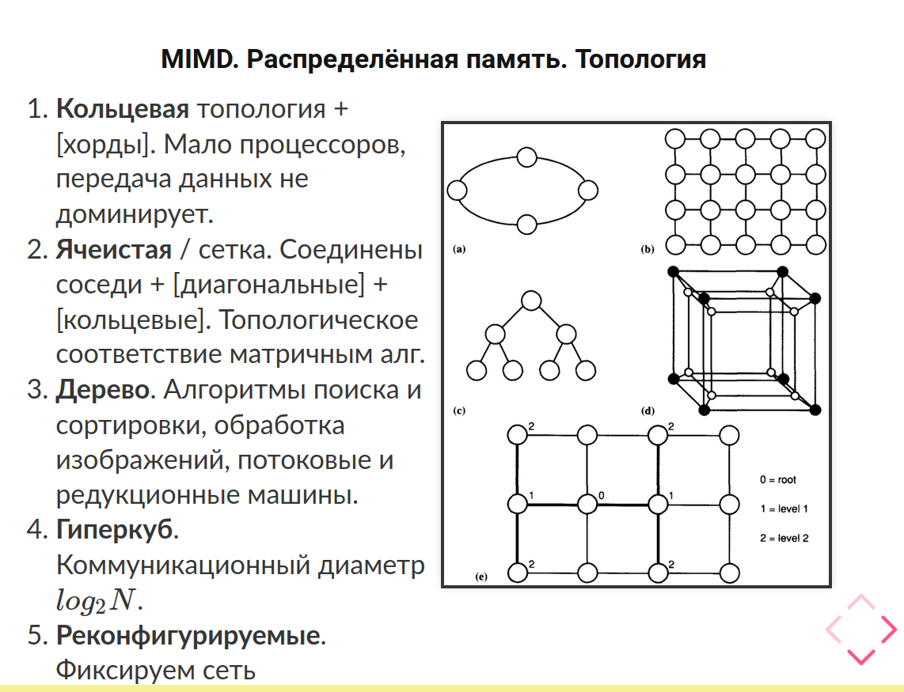
	
	Кольцевая топология + [хорды]. Мало процессоров, передача данных не доминирует.
	Ячеистая / сетка. Соединены соседи + [диагональные] + [кольцевые]. Топологическое соответствие матричным алг.
	Дерево. Алгоритмы поиска и сортировки, обработка изображений, потоковые и редукционные машины.
	Гиперкуб. Коммуникационный диаметр log2N.
	Реконфигурируемые. Фиксируем сеть конфигурацией, а не маршрутом.

Разделяемая память:
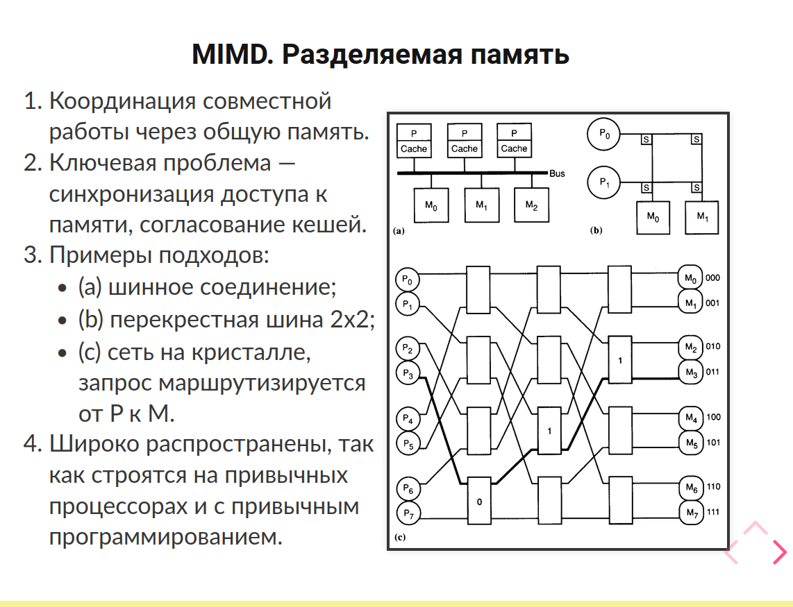
	
    Процессоры не связаны напрямую. Общение идёт серез общую память.
    Координация совместной работы через общую память.
    Ключевая проблема — синхронизация доступа к памяти, согласование кешей.
    Примеры подходов:
        (a) шинное соединение;
        (b) перекрестная шина 2x2;
        (c) сеть на кристалле, запрос маршрутизируется от P к M.
    Широко распространены, так как строятся на привычных процессорах и с привычным программированием.

### Вопрос_42. Классификация Дункана. Цели и задачи, классификация первого уровня. MIMD парадигмы (MIMD/SIMD, потоки данных, редукционные, wavefront) . Примеры и принципы их работы.

Смотреть начало вопроса 40 про Классификацию Дункана

Классификация по модели вычислений, выстроенной в мультипроцессорной системе. 
	
    1. Гибридные архитектуры, где управление MIMD (малые задачи) осуществляется в стиле SIMD (крупные задачи).
    То есть есть грубо говоря одиночный процесс, управляющий множеством потоков. 
    Очень часто подобная логика воспроизводится в программных системах. 
    2. Отношение ведущий — ведомый (master — slave) может быть представлено деревом:
        корень — работает как SIMD и распределяет задания;
        листья — работают как MIMD с локальной памятью.

Потоковые архитектуры - возможность выполнения и исполнения инструкций определяется исключительно наличием входных аргументов для инструкций. Порядок выполнения инструкций непредсказуем. 
	
    1. Алгоритм представляется в виде графа вычислений.
    2. Отсутствует память и канал доступа как "бутылочное горлышко".
    3. Проблема — передача данных между узлами.

Принципиальное отличие от систолической(см конец вопроса 40) архитектуры в том, что ей не требуется однозначной завязки аппаратной структуры на существующий алгоритм. Также не требуется общего такта управления. Синхронизация устанавливается динамически. 

Редукционная архитектура:

Не пытаемся представить вычислительный процесс в виде графа операций, а пытаемся представить вычисления функциональным подходом. Нам дают запрос, по которому уже определяется последовательность действий, необходимых для вычесления. ???

инструкции разрешаются к выполнению, когда их результаты требуются в качестве операндов для уже разрешенных инструкций. 

	1. Разрабатывались для параллелизма и ФП.
	2. Выполнение заключается в выборке инструкций и их замене на результат.
	3. Проблемы: ссылочная прозрачность, разворачивание 

Обычно реализуются опять же на уровне программных систем.

Wavefront - Комбинация систолической (см конец вопроса 40) архитектуры с асинхронным потоковым исполнением.

Управление происходит динамически, за счёт распространения сигнала по сети.
Синхронизация и режим работы выстраиваются динамически.
Проще в программировании. Лучше масштабируется.

В отличие от систолической архитектуры, синхронизация обеспечивается самими вычислительными модулями, но в остальном похоже. 

# P33082+P33092+P33102

### Студ_Вопрос_1. Как работает механизм копирования при записи (Copy-on-Write, COW) в файловой системе Linux и какова его ценность? Что такое состояние гонки? Перечислите и разъясните механизмы предотвращения состояния гонки в ядре Linux. (Лапин Алексей Александрович -- Dirty COW (CVE-2016-5195) - уязвимость ядра Linux)
Copy-On-Write — это оптимизационная техника, при которой при создании копии объекта данные физически не копируются, пока одна из копий не будет модифицирована.
Ценность:
 Экономия памяти. При создании копии объекта, фактически не выделяется новая память, а объекты разделяют одну и ту же область памяти. Новая память выделяется только при попытке изменить один из объектов.
Быстрое копирование. Так как при копировании по сути происходит создание указателя на существующий объект, а не полное копирование данных, то это значительно быстрее чем обычное копирование.
Состояние гонки (Race condition) — ситуация, когда несколько потоков или процессов читают и записывают элемент общих данных и конечный результат зависит от относительного времени выполнения этих потоков.
Механизмы предотвращения состояния гонки в ядре Linux:
Атомарные операции - Операция выполняется без прерываний и без вмешательства извне.
Циклические блокировки (spinlock) - Один поток захватывает блокировку, другой циклически ожидает доступности.
Циклические блокировки читателя/писателя — Несколько потоков, могут одновременно читать, но только один поток может записывает.
Семафоры - Целочисленное значение, используемое для передачи сигналов между процессами.
Операции (атомарные) над семафором:
Инициализация
Декримент (может привести к блокировке потока)
Инкремент (может привести к разблокировке потока)
Бинарный семафор – только два значения 0 и 1.
Мьютекс – бинарный семафор, но процесс блокирующий мьютекс, должен и разблокировать его.
Барьеры — Предотвращают переупорядочение операций компилятором и/или аппаратным обеспечением процессора.

### Студ_Вопрос_2. Формальная, функциональная и физическая Верификация в контексте микропроцессоров. Расскажите о её вышеперечисленных типах и их отличиях. Соотнесите каждый метод верификации с этапом разработки микропроцессора, на котором этот метод целесообразнее всего применять. (Панин Иван Михайлович -- Pentium fdiv bug)
Ответ: 
Формальная верификация: Установление эквивалентности представлений системы на разных этапах проектирования, выполнение утверждений, помещённых в исходный код. Также включает в себя статический анализ кода. Используется на этапе архитектурного проектирования и ещё раз на этапе
логического синтеза
Функциональная: Представляет собой набор тестов
Тесты обычно делятся на три группы: для проверки поведения системы в штатных
ситуациях, в ситуациях, отклоняющихся от спецификации и в ситуациях,
нарушающих протоколы спецификации.
Методы функциональной верификации:
Прямые тесты — тесты прототипа в конкретных точках работы, вызывающих
опасение у разработчиков.
Случайные тесты — генерация случайных воздействий на систему в заданных
диапазонах
Покрывающие тесты — тесты в рамках некоторого заданного покрытия системы
Обычно используется на этапе детального проектирования
Физическая: Проверка физического представления системы на совпадение с предыдущими
логическими, а также на соблюдение технологических норм, поставленных перед
проектом.
Состав проверок сильно зависит от конкретного разрабатываемого проекта.
Обычно проводится инженерами
Проводится на этапе физического синтеза.
  Этапы проектирования процессора: 
  Архитектурное проектирование — программный прототип на высокоуровневом
  языке
  Детальное проектирование — прототип на Verilog/VHDL и т. п.
  Логический синтез — создание логической схемы
  Физический синтез — создание физического прототипа

### Студ_Вопрос_3. В Unicode кодировках (UTF-8, UTF-16, …) есть такие понятия как Code Unit, Code Point, Grapheme Cluster. Дайте определения этим понятиям, объясните их взаимосвязь, приведите пример для наиболее популярных Unicode кодировок (UTF-8, UTF-16, UTF-32). (Гулямов Тимур -- Как языки программирования пытаются работать со строками?)
Code Unit - единица кодировки, которая имеет специфичный для конкретной кодировки размер (UTF-8 – 1 байт, UTF-16 – 2 байта, UTF-32 – 4 байта). Весь текст закодированный одной из Unicode кодировок состоит из последовательности code unit- ов.

Code Point - числовое значение, которое идентифицирует запись в Unicode таблице. Каждый code point кодируется одним или несколькими code unit-ми, в зависимости от кодировки (UTF-8 – 1-4 CU, UTF-16 – 1-2 CU,, UTF-32 – 1 CU).

Grapheme Cluster - последовательность code point-ов, представляемая для пользователя как один символ (например И (U+0418) +  ̆ (U+0306) = Й).

### Студ_Вопрос_4. В чём заключается суть методов обфускации и виртуализации, применяемых в программах протекторах для защиты кода от анализа извне? (Юнусов Роман -- Методы DRM защиты)
Ответ. Основная цель - защитить код от декомпиляции и усложнить его анализ, для этого и используются эти методы.
Обфускация - “запутывание” кода, когда в код добавляются элементы, мешающие декомпилированию и динамическому анализу.
Виды обфускации
Лексическая - 
удаление комментариев
замена имён на трудновоспринимаемые
лишние операции
изменение расположение частей программы
Обфускация структур данных - три вида
обфускация хранения - манипуляции с типами данных, например  разделение одной переменной на комбинацию переменныхизменение области действия переменной, изменение интерпретации данных
обфускация соединения - несколько независимых данных в одно, или разделение независимых = разделить структуру на независимые переменные, или наоборот соединить независимые переменные в массив.
обфускация переупорядочивания -изменение порядка объявления переменных или функций, изменение внутреннего порядка структур данных.
Обфускация потока управления - изменение порядка выполнения блоков программы
добавление избыточного, недостижимого кода
убирание вызовов библиотек
принудительное распараллеливание и т.д.
объединение и клонирование функций
Обфускация может работать на всех уровнях - исходный код, скомпилированный код или на уровне байт кода
Если спросит про минусы, то скорость работы и время от времени обфускатор может сломать исходную программу.

Виртуализация - тут всё просто, мы пытаемся перевести нашу программу(или её часть) на некий язык(байт код), известный только нам. В итоге при исполнении злоумышленник видит не вызов fact(10), а tcaf(6), потому что мы настроили что в виртуальной машине - tcaf - это факториал, а находится он от числа +4, относительно которого мы передали.
В итоге для дешифрации такого кода, злоумышленнику нужно досконально знать устройство виртуальной машины, при этом для разных частей программы могут использоваться разные виртуальные машины.
Также байткод может быть достаточно тяжелым для декомпиляции потому что не содержит имена или другую информацию, которая была в оригинальном коде.

### Студ_Вопрос_5. Расскажите об основых проблемах синхронизации между клиентами и серверами в сетевых играх: лагах, джиттере и потере пакетов. В чём заключаются и как методы предсказания ввода и расчета траектории помогают улучшить ситуацию? (Андриенко Сергей Вячеславович -- Основные проблемы синхронизации между клиентами и серверами в сетевых играх. Nocom Minecraft exploit.)
Основные проблемы синхронизации между клиентами и серверами в компьютерных играх
Давайте рассмотрим основные виды проблем, связанных с синхронизацией, которые чаще всего встречаются в играх.
Пинг
Пинг представляет собой время между отправкой запроса и получением ответа от игрового сервера. Чем меньше пинг, тем лучше - это гарантирует более быстрый отклик. Повышенные значения пинга указывают на возможные задержки или лаги.
Джиттер
Джиттером называются колебания значений пинга в определенный промежуток времени. Например, если пинг составлял 30 мс, а затем внезапно вырос до 80 мс, это указывает на наличие джиттера. Наличие джиттера может привести к тому, что пакеты данных будут опаздывать или приходить в неправильном порядке, что в конечном итоге порождает проблемы с откликом в сетевой игре или даже приводит к разрыву соединения.
Потеря пакетов
Нет никакой гарантии успешной доставки пакета данных. Его исчезновение и называется потерей пакета. В таких случаях приходится повторно отправлять пакет, что может привести к дополнительным задержкам.
Наличие любой из этих проблем может существенно мешать игровому процессу. В случае, если таких проблем несколько и они происходят регулярно, игроки могут решить, что лучше поиграть во что-то другое.
Методы решения проблем
Предсказание ввода
Предсказание ввода – это метод, направленный на сглаживание негативных эффектов задержек в сети. Он нацелен на то, чтобы сделать ввод игрока более отзывчивым, предвидя и обрабатывая действия игрока еще до того, как они обработаются на сервере.
Клиент локально реагирует на ввод пользователя до того, как сервер подтвердит ввод и обновит состояние игры. Таким образом, вместо того, чтобы клиент просто отправлял свои входные данные на сервер и ожидал обновления состояния игры, он также самостоятельно предсказывает состояние игры и дает обратную связь игроку.
Главным недостатком этого метода является возможное расхождение между ожидаемым ответом сервера и предсказанием клиента, что приводит к рассинхронизации между клиентом и сервером.
Расчет траектории
Расчет траектории - это метод, который заключается в оценке местоположения игровых объектов на основе их предыдущих координат, скорости, направления движения и других параметров. При возникновении задержки клиенту будет показано движение объектов в соответствии с рассчитанной траекторией до получения обновленного состояния игры от сервера.
Главным недостатком этого метода является возможность неточного расчета траектории движения объекта. Для смягчения резких переходов между ожидаемым и фактическим состоянием объекта, полученным с сервера, применяются различные алгоритмы сглаживания анимации.

### Студ_Вопрос_6. Как связаны система прерываний, режимы работы процессора и виртуальная память в рамках работы операционной системы при обработке исключения? (Тюрин Иван Николаевич -- Роль процессора в работе ОС на примере xv6-riscv.)
Короткий ответ: При возникновении исключения процессор вызывает прерывание, для обработки которого переходит по предопределенному адресу в виртуальной памяти с, если это возможно, изменением режима работы, для повышения уровня привилегий.
Подробный ответ: (см. доклад?t=2604 с презентацией, и 2 секции статьи) 
В случае выявления ошибки программы (например, деление на 0, обращение по недопустимому адресу, ошибка выравнивания данных…) процессор возбуждает исключение, т. е. изменяет процесс выполнения, сохраняя информацию о возникшей ошибке: ее тип, адрес в памяти, аргумент операции… Потом в дело вступает система прерываний. Процессор знает (специфицировано архитектурой или еще как определено, например, с помощью регистра, записей в виртуальной памяти) адрес обработчика прерывания, т. е. адрес с которого начинается специальный код, обрабатывающий прерывание. Тут обработчик прерывания обнаруживает (считывая значения регистров и/или еще чего-то) причину прерывания и поступает соответствующим образом. При этом код обработчика может выполняться только в привилегированном режиме (режиме в котором работает ядро, не меньше), ведь там есть код который управляет переключением потоков и не только. Поэтому страницы с этим кодом размаплены в виртуальной памяти соответствующим образом (только чтение и исполнение без пользовательского доступа). При возбуждении исключения повышается уровень привилегий процессора (aka режим работы, кольца безопасности), что и позволяет безопасно выполнять код обработчика. Также тут есть тонкий момент в том, какие операции производятся при переходе к обработчику прерывания, ведь этих действий должно быть как можно меньше для повышения эффективности (они происходят часто и нужно тратить меньше тактов),НАПРИМЕР, по большому счету достаточно сменить режим привилегий и сохранить pc (счетчик команд aka IP  в БЭВМ), и тут важно что таблица страниц виртуальной памяти не меняется, она переключится на таблицу страниц другого процесса в обработчике прерываний, но, чтобы не произошло исполнения кода обработчика по неверному адресу, код обработчика прерывания должен быть расположен во всех таблицах страниц виртуальной памяти на одних адресах. Описанное, как замечено ПРИМЕР, это то как устроено в RISC-V, но общий принцип должен быть понятен: переходим но известному адресу в виртуальной памяти с повышением уровня привилегий,  делая дополнительные специфицированные действия, сохранив безопасность выполнения кода. В обработчике при необходимости происходит сохранения состояния процесса путем записывания значений регистров в вектор прерывания. Выход из прерывания происходит проще. Архитектура должна поддерживать возможность возврата к предыдущему режиму процессора до прерывания. В RISC-V это инструкции sret, mret которые возвращают режим для текущего supervisor (sret) или machine (mret) mode и переходят на адрес начала кода обработчика возврата из прерывания, в котором уже восстанавливается состояние процесса по его вектору прерывания. Работа продолжается по новой.

### Студ_Вопрос_7. Как доменная адаптация, стресс тестирование и построение архитектуры моделей и структур данных помогают решить проблему обобщения в контексте ML?(Дробыш Дмитрий Александрович -- Проблемы современного ML.)
Порядок ответа ;
1 - Начало и смысл. 
Современные курсы по основам машинного обучения и анализу данных познакомят слушателя с задачами машинного обучения, алгоритмами для их решения, метриками (или эвристиками), математическими инструментами для анализа полученных результатов. Но очень мало внимания уделяется ситуациям, когда алгоритм написан правильно, но модель ведет себя некорректно:

Uninformative features . Пусть данные Train, Test принадлежат выборке X. Модель будет выдавать низкие результаты по точности на Train и Test.

Overfitting features . Пусть данные Train, Test принадлежат выборке X.  Модель хорошо работает на тренировочном наборе, но будет выдавать низкие результаты по точности на Test

Shortcut features . Пусть данные Train, Test принадлежат выборке X, Test2 принадлежит X2. Модель будет выдавать отличные результаты на Train и Test, но низкие результаты на Test2.

Дальше пример. ЛЮБОЙ:

В XX веке жила лошадь "Умный Ганс", которая умела считать. Она стучала копытом необходимое число раз, тем самым называя ответ. Это был шок для многих жителей, но разгадка оказалась слишком простой... Ганс просто по выражению лица спросившего понимал, когда нужно прекратить. Лошадь смогла найти обходной путь для решения задачи.

Автомобили Tesla начали воспринимать луну как жёлтый сигнал светофора.

2 - ТЕСТЫ: stress in the context of difficulty of understanding. 

Но и сейчас можно несколько доработать систему проверки. Воспользуйтесь некоторыми типами тестов:

Stratified evaluations - проверка на принадлежность данных к разным подгруппам или стратам.

Shifted evaluations - тестирование данных в условиях допустимых сдвигов в рамках решения задачи

Contrastive evaluations - переход от анализа качества модели к анализу изменения оценки в зависимости от данных.

3. - доменная адаптация

Если вы готовы пожертвовать потенциальной out of distribution вашей модели (корректная работа даже при сдвиге данных), то можно просто добавить больше тестов на нужную проблему в обучающий dataset.
Пример:
Автомобили Tesla начали воспринимать луну как жёлтый сигнал светофора.
Добавление тестов помогло модели выделять новый объект, а не пытаться подогнать его под известные ранее.
У этого способа есть две стороны.
Плюсы:

Легко применять.

Практически гарантирует решение конкретной проблемы.

Недостатки:

Переход от out of distribution к in distribution.

Не предотвращает новые проблемы такого характера.

Чтобы его применять, нужно обнаружить проблему.

4. Мысли про архитектуру:

Так как мы хотим создавать модели и сети, похожие на нас , стоит пересмотреть способы их тестирования.
По факту наши методы оценки являются привычными тестами ( как первая часть ЕГЭ ), где можно просто заучить правильные ответы...
А что будет в реальной жизни с таким учеником, если ему дать вместо вопросов эссе? Вероятно, экзамен он не сдаст.
Так и в нашей сфере стоит поставить под сомнение правильность анализа качества работы сетей и алгоритмов. Нужно подумать в сторону методик, объединяющих в себе и знание фактов и выделение основных мыслей. Такой подход поможет снизить вероятность возникновения shortcut learning.

Вспомни пролог, скажи, что там была именно логика, а не угадайка. Такие концепции были оптимальными, но реализация нет... Сейчас мир ии думает о решении тех проблем, чтобы это пересоздать. 

Конкретно, что хотим и что есть:

Уровень 1. Низкоуровневая локальная структура. В изображениях это набор локальных признаков (текстуры и границы), в текстах это буквы и морфология слов. Также сюда можно отнести уровень звукового/визуального восприятия текста и интонацию.
Уровень 2. Высокоуровневая иерархическая разреженная структура. В текстах эта структура начинается с синтаксиса, следующим уровнем является связь между предложениями, абзацами и более крупными частями текста. В изображениях обычно тоже есть некая иерархическая структура, соответствующая объектам и их частям в трехмерном пространстве на разном расстоянии. При этом между элементами иерархической структуры имеется разреженный граф смысловых и причинно-следственных взаимосвязей. Например, рассуждая о человеке на фотографии, мы никак не будем учитывать цвет стоящего неподалеку автомобиля. Разреженность помогает не обращать внимание на паразитные корреляции и избегать shortcut learning'а.

Очень трудно создать "универсальный ии" для решения широкого спектра задач.  В том числе и общего ии( см гугл )

На данный момент- да. Задача продумать не только количество тестов,  но и их виды. 
Простой пример: y= x*x - умеем, а x = y*y - нет. В школе  убили бы за такое 

Что мешает- все случаи не покрыть... варианты решения:

1)Делать конкретный ии под строгое точное описание задач. Но и не ныть потом, что мало умеет

2)В перспективе - что-то новое, что исправит этот недостаток. Ну и идеи есть, я их описал

### Студ_Вопрос_8. Сравните кодировки UTF-8 и UTF-16 по количеству байт, блоков, оперативности, ASCII-совместимости. В каких случаях разумно использование той или иной кодировки? Почему? (Абдурасул Кызы Мээрим -- История кодировок: Откуда такой зоопарк?)
Введение
Unicode - стандарт кодирования символов, включающий в себя знаки почти всех письменных языков мира.
Code Point - кодовая точка, значение в кодовом пространстве Unicode, то есть диапазон целых чисел от 0 до 0x10FFFF или 17*216 символов (1996).
Code Unit - единица кодировки, определенная последовательность битов.
Glyph - графическое представление символа.
UTF-<кол-во бит> - формат преобразования Юникода, использующий опр.кол бит.
Проблемы совместимости
UTF-8 файл, содержащий только символы ASCII, идентичен файлу ASCII. Унаследованные программы обычно могут обрабатывать файлы, закодированные в UTF-8, даже если они содержат не-ASCII символы. Потому что первые 127 символов Unicode полностью повторяют ASCII, и после расширения ASCII стало восьмибитной.
 
(Например, функция printf в языке C может печатать UTF-8 строку, так как она ищет только символ '%' ASCII для определения форматирующей строки и печатает все остальные байты без изменений, следовательно, не-ASCII символы будут выведены без изменений.)
 
UTF-16 и UTF-32 несовместимы с файлами ASCII и, следовательно, требуют программ, осведомленных о Unicode, для отображения, печати и манипулирования ими, даже если известно, что файл содержит только символы из подмножества ASCII. Из-за наличия множества нулевых байтов строки не могут быть обработаны обычными операциями обработки строк с завершением нулевым байтом, даже для простых операций, таких как копирование.
 
Оперативность
UTF-8 требует 8, 16, 24 или 32 бита (от одного до четырех байт) для кодирования символа Unicode, UTF-16 требует 16 или 32 бита для кодирования символа, и UTF-32 всегда требует 32 бита для кодирования символа. Первые 128 кодов Unicode, U+0000 по U+007F, используемые для символов C0 Controls и Basic Latin, кодируются с использованием 8 бит в UTF-8, 16 бит в UTF-16 и 32 бита в UTF-32.
 
Следующие 1 920 символов, U+0080 по U+07FF (охватывающие оставшуюся часть почти всех латинских алфавитов, а также греческий, кириллический, армянский, иврит, арабский, сирийский), требуют 16 бит для кодирования как в UTF-8, так и в UTF-16, и 32 бита в UTF-32. Для U+0800 по U+FFFF, т.е. оставшихся символов в основной многозначной плоскости (BMP, плоскость 0, U+0000 по U+FFFF), охватывающих остальные символы большинства живых языков мира, UTF-8 требует 24 бита для кодирования символа, в то время как UTF-16 требует 16 бит, и UTF-32 требует 32. Кодовые точки U+010000 по U+10FFFF, представляющие символы в дополнительных плоскостях (плоскости 1–16), требуют 32 бита в UTF-8, UTF-16 и UTF-32.
 
Следовательно, файл короче в UTF-8, чем в UTF-16, если существует больше кодовых точек ASCII, чем кодовых точек в диапазоне U+0800 по U+FFFF. Интересно, что документы, написанные на языках, использующих символы только в высоком диапазоне, часто все еще короче в UTF-8, из-за обширного использования пробелов, цифр, знаков препинания, символов новой строки, HTML-разметки и встроенных слов и акронимов, написанных латинскими буквами. UTF-32 всегда длиннее, пока не выполняется условие, что строка не содержит кодовые точки меньше U+10000.
Время обработки
Текст с кодировкой переменной длины, такой как UTF-8 или UTF-16, сложнее обрабатывать, если есть необходимость работать с отдельными кодовыми единицами. Поиск не зависит от того, переменного размера символы или нет, поскольку поиск последовательности кодовых единиц не зависит от их размеров (требуется, чтобы кодировка была самосинхронизирующейся - UTF-8 и UTF-16). Распространенное заблуждение заключается в том, что есть необходимость "найти n-й символ" и что это требует кодировки фиксированной длины; однако на практике число n производится только при рассмотрении n−1 символов, таким образом, в любом случае требуется последовательный доступ.
 
Когда последовательности символов с одним порядком байтов загружаются на машину с другим порядком байтов(big-endian/little-endian), символы должны быть сконвертированы перед тем, как их можно эффективно обработать (или нужны два процессора). Байтовые кодировки, такие как UTF-8, не имеют этой проблемы. UTF-16BE и UTF-32BE — big-endian, UTF-16LE и UTF-32LE — little-endian.

### Студ_Вопрос_9. Как с помощью page fault можно определить длину недокументированной инструкции, даже если онэто ошибочная инструкция и у нас нет прав на исполнение такой? (Никита Манжиков -- Аудит/тестирование x86 процессоров.Нахождение аномалий. )
Основная идея:
Цель - определить длину произвольной (потенциально недокументированной) x86 инструкции.
Для этого предложен метод, который включает в себя инкрементирование байта инструкции и использование техники page fault analysis.
Техника page fault analysis:
Инструкция помещается в память так, чтобы первый байт инструкции находился на последнем байте исполнимой страницы, а остальная часть инструкции - на неисполнимой странице.
Если происходит исключение общей защиты во время извлечения инструкции, процессор вызывает прерывание #GP, и адрес границы страницы передается в процесс fuzzing'а в качестве аргумента исключения.
Если fuzzer определяет, что инструкция еще не полностью находится в исполнимой памяти, инструкция сдвигается на байт назад, чтобы первые два байта находились на исполнимой странице, а остальные - на неисполнимой.
Процесс повторяется до тех пор, пока не произойдет #GP fault или пока не достигнется граница страницы. Количество байт, находящихся в исполнимой странице, указывает на длину инструкции.
Преимущества техники:
Позволяет определить длину даже незаконных (не существующих) инструкций.
Процесс может различать между инструкциями, которые не существуют, и теми, которые существуют, но ограничены более привилегированными кольцами.
Заключение:
Этот метод page fault analysis совместно с алгоритмом tunneling позволяет эффективно исследовать x86 инструкции, даже если у нас нет прав на их исполнение.
Техника позволяет обойти проблемы постоянного повреждения системного или процессного состояния при фаззинге аппаратных инструкций.
Чтобы понять лучше посмотреть это видео до 16 минуты 
Понять алгоритм можно только во время исполнения 
https://www.youtube.com/watch?v=KrksBdWcZgQ
Статья на английском(слишком подробная )https://www.blackhat.com/docs/us-17/thursday/us-17-Domas-Breaking-The-x86-Instruction-Set-wp.pdf

