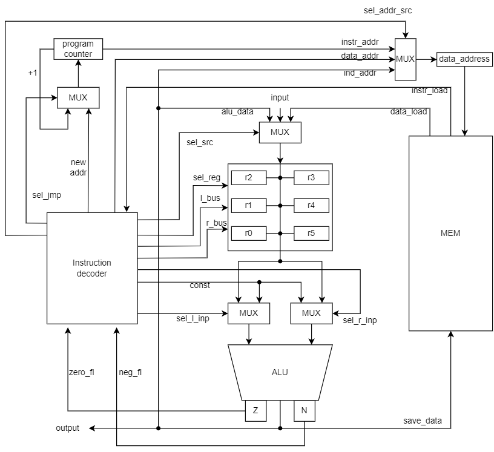

# Лаб.3 Эксперимент

## Язык программирования

### Синтаксис 

    s-expr ::= list | s-expr s-expr  
    list ::= "(" function args")"  
    args ::=  word | number | list 
    function ::= math_operation | operation
    math_operation ::= "!=" | "*" | "+" | "-" | "/" | "%" | "=" | > | < 
    operation ::= defv | setq | loop | if | return-from | print | printstr | printc
    letter ::= "a" | "b" | ... | "z" | "A" | ... | "Z"
    word ::= letter | letter word
    digit ::= "1" | "2" | ... | "9" | "0"
    number ::= digit | digit number
* `defv <arg1> <arg2>` - объявляет переменную `<arg1>` и присваивает ей начальное значение `<arg2>`
* `setq <arg1> <arg2>` - присваивает объявленной переменной `<arg1>` новое значение `<arg2>`
* `loop <label>` - бесконечный цикл, может иметь свою метку `<label>` (опционально) 
* `return-from <target-label>` - безусловный переход на следующее выражение после выражения, на которое указывает целевая метка `<target-label>`
* `if (cond) (then block) (else block)` - оператор ветвления (else block - опционально)
* `print <arg>` - вывод целого числа
* `+ | - | * | / | % <arg1> <arg2>...<argn>` - арифметические операции над аргументами, минимальное кол-во аргументов: 2
* `!= | = | < | > <arg1> <arg2>`- операторы сравнения, принимают два аргумента
* `printc <arg>` - вывод символа
* `printstr <arg>` - вывод строки
* Типы данных - целочисленные переменные, строки, константы

## Организация памяти

Архитектура - фон Неймановская

Машинное слово 32 бита, знаковое. Реализуется списком словарей, одна ячейка памяти - одна инструкция/целочисленная переменная/символ.  
Адресация - прямая абсолютная, косвенная регистровая.  
Память разделена на сегменты данных и команд, первые 50 ячеек под переменные, следующие 50 под строки. Сегмент команд начинается с ячейки 100.
Константы - захардкожены в инструкции
```text
              memory
+---------------------------------+
| 000: var                        |
| ...                             |
| 049: var                        |
| 050: string(char)               |
| ...                             |
| 099: string(char)               |
| 100: program start              |
| ...                             |
+---------------------------------+
```
## Система команд
Особенности процессора 
Машинное слово - 32 бита, знаковое. 
* Память:
  * адресуется через регистр `data_address`, может быть изменён:
    * из регистра `program counter -> instr_addr`
    * из декодера команд `data_addr`
    * из АЛУ
  * можно писать:
    * из АЛУ
  * можно читать:
    * в декодер команд
    * в регистры общего назначения
* Регистры общего назначения `r0-r5`:
  * можно писать:
    * из памяти
    * из АЛУ
    * с порта ввода
  * можно читать:
    * `l-bus` шина к левому входу АЛУ
    * `r-bus` шина к правому входу АЛУ
* Флаги Z, N:
* `program_counter` -- счётчик команд:
  * инкрементируется после каждой инструкции или перезаписывается инструкцией перехода.
* АЛУ:
  * `l_alu` - регистр левого операнда, может принимать данные:
    * из регистров общего назначения по `l_bus`
    * константы из декодера команд `l_const`
  * `r_alu` - регистр правого операнда, может принимать данные:
    * из регистров общего назначения по `r_bus`
    * константы из декодера команд `r_const`
  * `alu` - регистр результата
### Набор инструкций
| Syntax | Mnemonic     | Кол-во тактов | Comment                           |
|:-------|:-------------|---------------|:----------------------------------|
| `+`    | add          | 2             | Сложение двух аргументов: регистр/константа, регистр/константа |
| `-`    | sub          | 2             | Вычитание из первого аргумента второго: регистр/константа, регистр/константа |
| `*`    | mul          | 2             | Умножение двух аргументов: регистр/константа, регистр/константа |
| `/`    | dev          | 2             | Деление первого аргумента на второй: регистр/константа, регистр/константа |
| `%`    | mod          | 2             | Получение остатка от деления первого аргумента на второй: регистр/константа, регистр/константа |
| `=/!=/>/<`       | cmp          | 2             | Вычитание с установкой флагов `zero` и `neg` |
| `print`| print        | 2             | см. язык                          |
|`printc`| printc       | 2             | см. язык                          |
| `read` | read         | 1             | Чтение символа из входного буфера |
|        | mov          | 2             | Загрузка данных в память/регистр из регистра/памяти |
|        | jmp          | 1             | Безусловный переход               |
|        | je           | 1             | Переход, если `zero` = 1          |
|        | jne          | 1             | Переход, если `zero` = 0          |
|        | jle          | 1             | Переход, если `zero` = 1 или `neg` = 1    |
|        | jge          | 1             | Переход, если `zero` = 1 или `neg` = 0    |
|        | halt         | 0             | Остановка                         |
### Кодирование инструкций
* Машинный код сериализуется в список JSON.
* Один элемент списка, одна инструкция.
* Индекс списка -- адрес инструкции. Используется для команд перехода.  
Пример:
```json
[
      {
          "opcode": "cmp",
          "arg1": "r0",
          "arg2": "0",
          "res_reg": "r0",
          "term": "cmp"
      }
]
```
где:
* `opcode` -- строка с кодом операции 
* `arg1` -- первый аргумент (может отсутствовать)
* `arg2` -- второй аргумент (может отсутствовать)
* `res_reg` -- регистр, в который будет записан результат  (может отсутствовать)
## Транслятор
Интерфейс командной строки: `translator.py <input_file> <target_file>`  
Реализовано в модуле: [translator](./translator.py)  
Этапы трансляции(функция `translate`):
1) Исходный код преобразуется в набор термов
2) Проверка парности скобок
3) Функции преобразуются в последовательность инструкций
4) Переменные заносятся в словарь, в функциях заменяются на адреса
5) Распределение регистров для инструкций
## Модель процессора
Реализовано в модуле: [machine](./machine.py)  
Объединенная схема `DataPath` и `ControlUnit`:  

### DataPath
Реализован в классе `DataPath`  
Сигналы (обрабатываются за один такт, реализованы в виде методов класса):  
* `sel_l_bus` - передать значение из регистра по левой шине
* `sel_r_bus` - передать значение из регистра по правой шине
* `sel_l_inp` - выбрать источник данных для левого входа алу
* `sel_r_inp` - выбрать источник данных для правого входа алу
* `calc_alu` - выбор операции в алу
* `set_zero`- выставить `zero` флаг в соответствии со значением в алу
* `set_neg`-  выставить `neg` флаг в соответствии со значением в алу
* `sel_reg` - выбрать регистр для записи и источник данных
* `sel_addr_src` - выбрать источник данных для регистра `data_address`
* `write` - записать значение из алу в память
* `input` - прочитать символ из регистра ввода в выбранный регистр общего назначения 
* `output` - передать данные из алу в регистр вывода
### ControlUnit
Реализован в классе `ControlUnit`  
* Hardwired (реализовано полностью на python).
* Моделирование на уровне инструкций.
* Трансляция инструкции в последовательность сигналов: `decode_and_execute_instruction`  
Сигнал:
* `latch_program_counter` -- сигнал для обновления счетчика команд в зависимости от значения на выходе мультиплексора `sel_next`  

Особенности работы модели:  
* Для журнала состояний процессора используется стандартный модуль logging.
* Количество инструкций для моделирования ограничено hardcoded константой.
* Остановка моделирования осуществляется при помощи исключений:
  * StopIteration -- если выполнена инструкция `hlt`.

Управление симуляцией реализовано в функции `simulate`.
## Апробация
В качестве тестов использовано четыре алгоритма:
1. [hello](./examples/hello.txt) -- вывод `Hello world`
2. [cat](./examples/cat.txt) -- программа `cat`, повторяем ввод на выводе.
3. [Hello Username](./examples/hello_username.txt) --  запросить у пользователя его имя, считать его, вывести на экран приветствие. 
3. [prob1](./examples/prob1.txt) -- проблема Эйлера 1.
4. [prob2](./examples/proba2.txt) -- проблема Эйлера 2.
5. [prob5](./examples/proba5.txt) -- проблема Эйлера 5.  

Интеграционные тесты реализованы тут: [integration_test](./integration_test.py)  
CI
```yaml
lab3:
  stage: test
  image:
    name: python-tools
    entrypoint: [""]
  script:
    - pip3 install --no-cache-dir -r requirements.txt
    - python3-coverage run -m pytest --verbose
    - find . -type f -name "*.py" | xargs -t python3-coverage report
    - find . -type f -name "*.py" | xargs -t pep8 --ignore=E501
    - find . -type f -name "*.py" | xargs -t pylint --disable=C0114,C0115,C0116,C0209,C0301,R0902,R0912,R0914,R0915
```
где:
* `python3-coverage` -- формирование отчёта об уровне покрытия исходного кода.
* `pytest` -- утилита для запуска тестов.
* `pep8` -- утилита для проверки форматирования кода. `E501` (длина строк) отключено.
* `pylint` -- утилита для проверки качества кода. Некоторые правила отключены с целью упрощения кода.

| ФИО           | алг.                                          | LoC | code байт | code инстр. | инстр. | такт. | вариант                                                  |
|---------------|-----------------------------------------------|-----| --------- |-------------|--------|-------|----------------------------------------------------------|
| Голиков Д. И. | [cat](./golden/cat.yml)                       | 4   | -         | 4           | 36     | 60    | `lisp, risc, neum, hw, instr, stream, port, pstr, prob1` |
| Голиков Д. И. | [hello](./golden/hello.yml)                   | 3   | -         | 7           | 66     | 119   | `lisp, risc, neum, hw, instr, stream, port, pstr, prob1` |     
| Голиков Д. И. | [hello_username](./golden/hello_username.yml) | 14  | -         | 10          | 139    | 248   | `lisp, risc, neum, hw, instr, stream, port, pstr, prob1` |     
| Голиков Д. И. | [prob1](./golden/prob1.yml)                   | 63  | -         | 35          | 6928   | 12589 | `lisp, risc, neum, hw, instr, stream, port, pstr, prob1` |     
| Голиков Д. И. | [prob2](golden/proba2.yml)                    | 47  | -         | 24          | 534    | 976   | `lisp, risc, neum, hw, instr, stream, port, pstr, prob1` |     
| Голиков Д. И. | [prob5](golden/proba5.yml)                    | 69  | -         | 36          | 449    | 822   | `lisp, risc, neum, hw, instr, stream, port, pstr, prob1` |     
